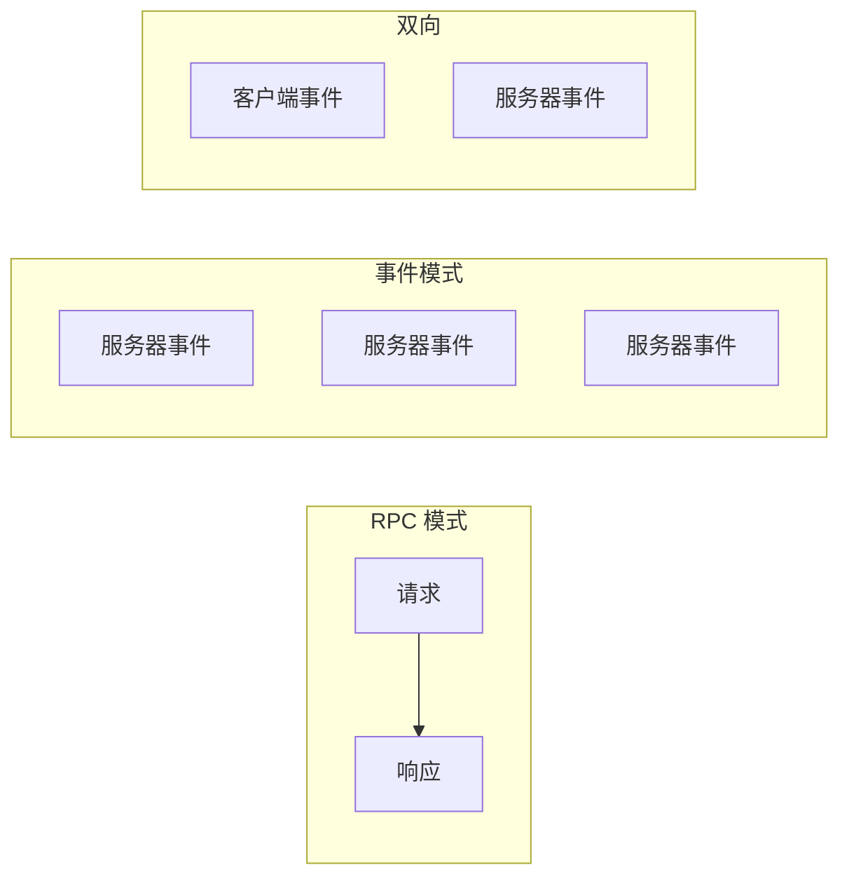
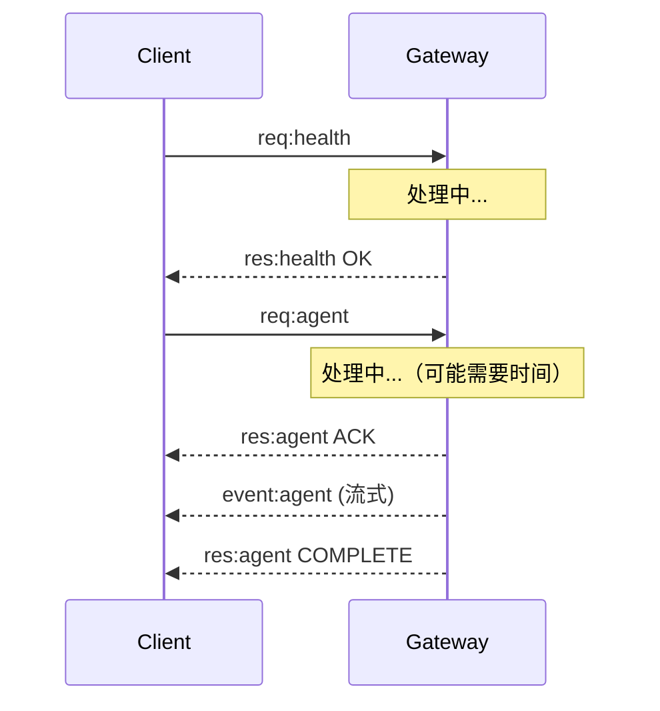
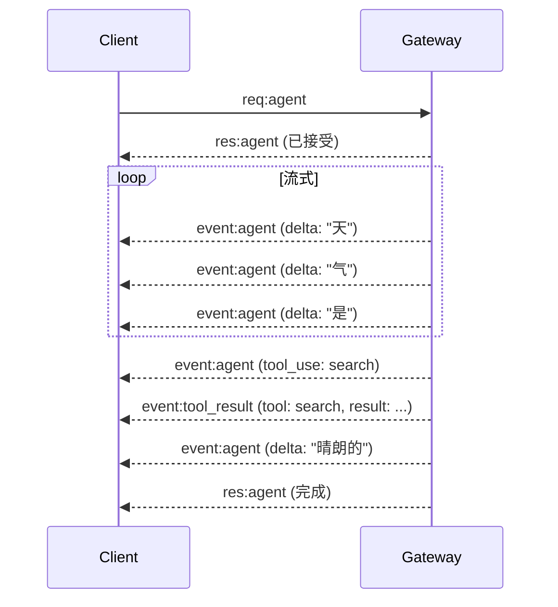

# 事件和 RPC

## 概述

OpenClaw 使用混合通信模式，结合 RPC 请求/响应与服务器推送事件以实现实时更新。

## 通信模式



## 请求/响应模式

### 标准 RPC 流程



### 请求结构

```typescript
interface RPCRequest {
  type: "req";
  id: string;             // 唯一请求 ID
  method: string;         // 方法名
  params: unknown;        // 参数
  idemKey?: string;       // 幂等键
  timeout?: number;       // 超时时间（毫秒）
}

// 示例：Agent 运行请求
{
  type: "req",
  id: "req-001",
  method: "agent",
  params: {
    sessionKey: "telegram:dm:123456",
    agentId: "main",
    input: "你好，你好吗？",
    modelRef: "openai:gpt-4o",
    idemKey: "msg-123"
  },
  timeout: 60000
}
```

### 响应结构

```typescript
interface RPCResponse {
  type: "res";
  id: string;             // 匹配请求 ID
  ok: boolean;
  payload?: unknown;      // 成功负载
  error?: {
    code: string;
    message: string;
    details?: unknown;
  };
}

// 成功响应
{
  type: "res",
  id: "req-001",
  ok: true,
  payload: {
    runId: "run-456",
    status: "accepted"
  }
}

// 错误响应
{
  type: "res",
  id: "req-001",
  ok: false,
  error: {
    code: "SESSION_NOT_FOUND",
    message: "会话 'xyz' 不存在",
    details: { sessionKey: "xyz" }
  }
}
```

## 流式响应

### Agent 流式传输



### 流式事件

```typescript
// Assistant delta 事件
{
  type: "event",
  event: "agent",
  payload: {
    runId: "run-456",
    type: "assistant.delta",
    delta: "天气是"
  }
}

// 工具使用事件
{
  type: "event",
  event: "agent",
  payload: {
    runId: "run-456",
    type: "tool_use",
    tool: "web_search",
    input: { query: "今天天气" }
  }
}

// 工具结果事件
{
  type: "event",
  event: "agent",
  payload: {
    runId: "run-456",
    type: "tool_result",
    tool: "web_search",
    result: { results: [...] }
  }
}

// 完成事件
{
  type: "event",
  event: "agent",
  payload: {
    runId: "run-456",
    type: "complete",
    summary: "今天天气晴朗..."
  }
}
```

## 服务器推送事件

### 事件类别

| 类别 | 事件 | 描述 |
|----------|--------|-------------|
| Agent | `agent` | Agent 进度/结果 |
| 聊天 | `chat`, `chat.reaction` | 传入消息 |
| 状态 | `presence` | Channel/用户状态 |
| 健康 | `tick`, `health` | 系统状态 |
| 系统 | `shutdown`, `restart` | 系统事件 |

### Tick 事件

```typescript
// 每 5 秒发出
{
  type: "event",
  event: "tick",
  payload: {
    timestamp: "2024-01-15T10:30:00.000Z",
    uptime: 86400,
    memory: { used: 128, total: 512 },
    sessions: {
      active: 15,
      total: 42
    },
    channels: [
      { id: "telegram", status: "connected", latency: 45 },
      { id: "discord", status: "connected", latency: 32 }
    ],
    health: "healthy"
  }
}
```

### Presence 事件

```typescript
// 在连接/断开连接时发出
{
  type: "event",
  event: "presence",
  payload: {
    channels: [
      {
        id: "telegram",
        status: "connected",
        users: 5,
        details: { bot: "@mybot" }
      }
    ],
    agents: [
      {
        id: "main",
        status: "active",
        sessions: 8,
        running: 2
      }
    ]
  }
}
```

### Chat 事件（入站）

```typescript
// 当从 Channel 收到消息时
{
  type: "event",
  event: "chat",
  payload: {
    channel: "telegram",
    target: "123456",
    message: {
      id: "msg-789",
      from: { id: "456", name: "用户" },
      content: "你好！",
      timestamp: "2024-01-15T10:30:00.000Z"
    },
    sessionKey: "telegram:dm:456"
  }
}
```

## RPC 方法

### 核心方法参考

```typescript
const RPC_METHODS = {
  // 连接
  connect: "初始握手",
  disconnect: "优雅断开",

  // Agent 操作
  agent: "运行 Agent 并输入",
  agent_abort: "中止运行的 Agent",
  agent_status: "获取 Agent 运行状态",

  // 消息
  send: "发送消息到 Channel",
  send_reply: "回复消息",

  // 会话
  session_create: "创建会话",
  session_get: "获取会话信息",
  session_reset: "重置会话上下文",

  // 系统
  health: "获取健康状态",
  status: "获取系统状态",
  config_get: "获取配置",
};
```

### Agent 方法

```typescript
// 请求
{
  type: "req",
  id: "req-abc",
  method: "agent",
  params: {
    sessionKey: "telegram:dm:123456",
    agentId: "main",
    input: "我今天有什么会议？",
    modelRef: "anthropic:claude-opus-4",
    idemKey: "meetings-123"
  }
}

// 响应（立即确认）
{
  type: "res",
  id: "req-abc",
  ok: true,
  payload: {
    runId: "run-xyz",
    status: "accepted"
  }
}
```

### Send 方法

```typescript
// 请求
{
  type: "req",
  id: "req-def",
  method: "send",
  params: {
    channel: "telegram",
    target: "123456",
    message: {
      content: "你的会议在下午 2 点",
      buttons: [
        [{ label: "接受", data: "accept-123" }, { label: "拒绝", data: "decline-123" }]
      ]
    },
    idemKey: "send-456"
  }
}

// 响应
{
  type: "res",
  id: "req-def",
  ok: true,
  payload: {
    messageId: "msg-out-001",
    timestamp: "2024-01-15T10:35:00.000Z"
  }
}
```

## 客户端实现

### 请求队列

```typescript
class RequestQueue {
  private pending = new Map<string, Deferred>();
  private processing = false;
  private maxConcurrent = 5;

  async request<T>(method: string, params: unknown): Promise<T> {
    const id = generateId();
    const deferred = new Deferred<T>();
    this.pending.set(id, deferred);

    await this.send({ type: "req", id, method, params });

    return deferred.promise;
  }

  private handleResponse(frame: RPCResponse) {
    const deferred = this.pending.get(frame.id);
    if (!deferred) return;

    if (frame.ok) {
      deferred.resolve(frame.payload as T);
    } else {
      deferred.reject(new RPCError(frame.error));
    }

    this.pending.delete(frame.id);
  }
}
```

### 事件订阅

```typescript
class EventSubscriber {
  private handlers = new Map<string, Set<EventHandler>>();

  on(event: string, handler: EventHandler): void {
    if (!this.handlers.has(event)) {
      this.handlers.set(event, new Set());
    }
    this.handlers.get(event).add(handler);
  }

  off(event: string, handler: EventHandler): void {
    this.handlers.get(event)?.delete(handler);
  }

  handleEvent(frame: EventFrame) {
    const handlers = this.handlers.get(frame.event);
    handlers?.forEach(handler => {
      try {
        handler(frame.payload, frame);
      } catch (error) {
        console.error(`处理器错误 ${frame.event}:`, error);
      }
    });

    // 也处理通配符处理器
    const wildcards = this.handlers.get("*");
    wildcards?.forEach(handler => handler(frame.payload, frame));
  }
}
```

## 相关

- [协议概述](/architecture-book/part-4-gateway-protocol/01-protocol-overview) - 协议设计
- [WebSocket 传输](/architecture-book/part-4-gateway-protocol/02-ws-transport) - 传输层
- [消息流](/architecture-book/part-4-gateway-protocol/03-message-flow) - 消息处理