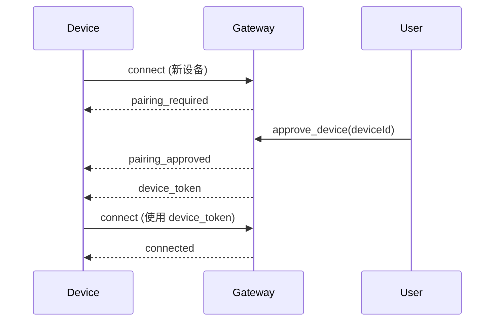
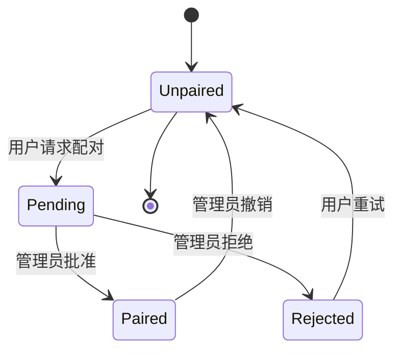
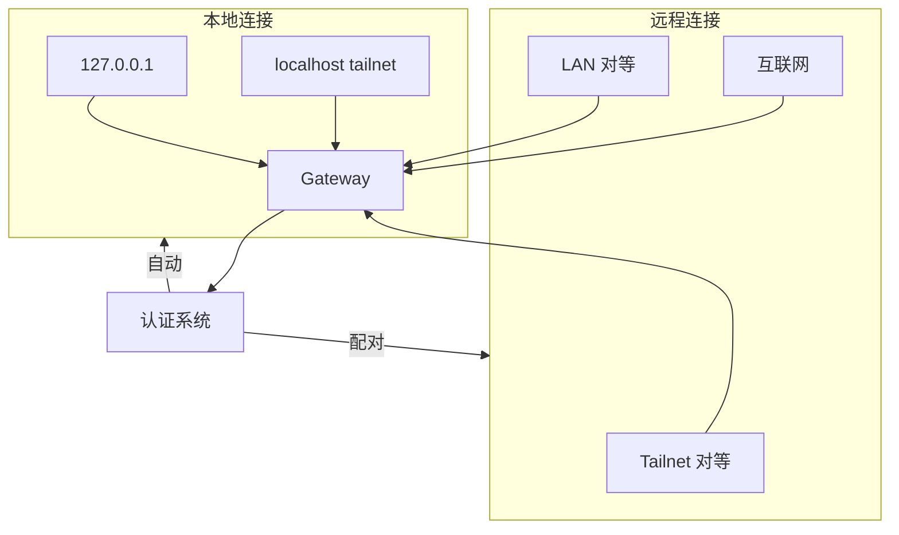

# 认证与安全

## 概述

OpenClaw 实现多种认证模式和安全措施，以保护网关访问和设备配对。

## 认证模式

### 模式对比

| 模式 | 使用场景 | 凭证 | 信任源 |
|------|----------|-------------|--------------|
| `token` | 默认 | 共享密钥 | 连接参数 |
| `password` | 简单认证 | 密码 | 连接参数 |
| `tailscale` | 远程访问 | 无 | Tailscale 身份 |
| `trusted-proxy` | 代理后 | 无 | 代理头 |
| `none` | 仅本地 | 无 | 仅回环 |

### Token 认证

```typescript
// 配置
const config = {
  gateway: {
    auth: {
      mode: "token",
      token: process.env.OPENCLAW_GATEWAY_TOKEN,
    }
  }
};

// 客户端连接
{
  type: "connect",
  params: {
    auth: {
      token: "sk-openclaw-xxxxx"
    },
    // ...
  }
}
```

### 密码认证

```typescript
const config = {
  gateway: {
    auth: {
      mode: "password",
      password: "secure-password",
    }
  }
};
```

## 设备配对

### 配对流程



### 设备元数据

```typescript
interface DeviceMetadata {
  id: string;            // 唯一设备 ID
  name: string;          // 用户友好名称
  platform: string;      // macos、ios、android 等
  family?: string;       // iPhone、MacBook 等
  createdAt: string;
  lastSeen?: string;
  status: "pending" | "paired" | "rejected";
  pairingApprovedBy?: string;
}

interface DeviceToken {
  deviceId: string;
  token: string;
  expiresAt: string;
}
```

### 配对状态



## Tailscale 集成

### Tailscale 认证模式

```typescript
const config = {
  gateway: {
    auth: {
      mode: "tailscale",
      allowTailscale: true,
    }
  }
};
```

### Tailscale 身份

当 `allowTailscale: true` 时，网关信任请求头中的 Tailscale 身份：

```typescript
// 不需要认证参数 - 使用 Tailscale 身份
{
  type: "connect",
  params: {
    device: {
      id: "device-uuid",
      name: "my-device",
      platform: "macos"
    },
    // 没有 auth 字段
  }
}

// 网关使用：
// - Tailscale 身份 (user@tailnet)
// - Tailscale 中的设备名称
// - 无需额外认证
```

### Tailscale 特定规则

| 方面 | 行为 |
|--------|----------|
| 回环 | 自动批准 |
| Tailnet | 需要配对批准 |
| LAN | 需要显式配对 |
| 远程 | 信任 Tailscale 身份 |

## 签名验证

### 质询-响应

```typescript
interface ChallengeRequest {
  type: "challenge";
  challenge: string;     // 随机 nonce
  timestamp: number;     // 请求时间戳
}

// 客户端必须签名质询
interface SignedConnect {
  type: "connect";
  challenge: string;
  signature: string;      // 质询的 HMAC
  signatureVersion: "v3";
}

function signChallenge(challenge: string, secret: string): string {
  return crypto
    .createHmac("sha256", secret)
    .update(challenge)
    .update(VERSION)      // "v3" 绑定平台 + deviceFamily
    .digest("hex");
}
```

### 签名版本 v3

v3 签名绑定额外的元数据：

```typescript
function createSignatureV3(params: {
  challenge: string;
  secret: string;
  platform: string;
  deviceFamily: string;
}): string {
  const payload = [
    params.challenge,
    params.platform,
    params.deviceFamily,
  ].join(":");

  return crypto
    .createHmac("sha256", params.secret)
    .update(payload)
    .digest("hex");
}
```

## 信任边界

### 连接来源



### 信任级别

| 来源 | 信任级别 | 所需认证 |
|--------|-------------|---------------|
| 回环 (127.0.0.1) | 高 | 最小 |
| Tailscale（同 tailnet） | 高 | 设备配对 |
| LAN（同网络） | 中 | 设备配对 + 认证 |
| 互联网 | 低 | 完全认证 + 配对 |

## 安全加固

### 推荐配置

```typescript
const hardenedConfig = {
  gateway: {
    auth: {
      mode: "token",
      token: process.env.SECURE_TOKEN,  // 使用强 token
      allowTailscale: true,            // 通过 Tailscale 远程访问
      allowLocalAutoApprove: false,    // 本地也需要配对
    },

    // 速率限制
    rateLimit: {
      windowMs: 60000,    // 1 分钟窗口
      maxRequests: 100,   // 每个窗口最大请求数
    },

    // TLS（用于非本地访问）
    tls: {
      enabled: true,
      certPath: "/path/to/cert.pem",
      keyPath: "/path/to/key.pem",
    },
  }
};
```

### Token 生成

```bash
# 生成安全 token
openssl rand -hex 32

# 或使用 Python
python3 -c "import secrets; print(secrets.token_urlsafe(32))"
```

## 速率限制

### 速率限制配置

```typescript
interface RateLimitConfig {
  windowMs: number;        // 时间窗口（毫秒）
  maxRequests: number;     // 每个窗口最大请求数
  maxTokens: number;       // 每个窗口最大 token 数（用于 token 认证）
  blockDuration: number;   // 超过限制后的阻止时间
}

const rateLimit: RateLimitConfig = {
  windowMs: 60000,         // 1 分钟
  maxRequests: 100,
  maxTokens: 10000,
  blockDuration: 60000,    // 超过时阻止 1 分钟
};
```

### 速率限制响应

```typescript
// 当被速率限制时
{
  type: "res",
  id: "req-123",
  ok: false,
  error: {
    code: "RATE_LIMITED",
    message: "请求过多",
    details: {
      limit: 100,
      window: "1m",
      retryAfter: 45000
    }
  }
}
```

## 错误代码

### 认证错误

| 代码 | 描述 | 操作 |
|------|-------------|--------|
| `AUTH_FAILED` | 无效凭证 | 检查凭证 |
| `AUTH_EXPIRED` | Token/密钥过期 | 重新生成 |
| `AUTH_REQUIRED` | 未提供认证 | 包含认证 |
| `DEVICE_NOT_PAIRED` | 设备未批准 | 请求配对 |
| `DEVICE_REJECTED` | 配对被拒绝 | 联系管理员 |
| `SIGNATURE_INVALID` | 质询签名错误 | 重试签名 |

### 错误响应格式

```typescript
{
  type: "res",
  id: "req-123",
  ok: false,
  error: {
    code: "AUTH_FAILED",
    message: "无效的认证 token",
    details: {
      reason: "Token 不匹配",
      hint: "确保 OPENCLAW_GATEWAY_TOKEN 正确"
    }
  }
}
```

## 最佳实践

### 安全清单

- [ ] 使用强随机生成的 token
- [ ] 为远程连接启用 TLS
- [ ] 优先使用 Tailscale 而非暴露到互联网
- [ ] 新设备需要设备配对
- [ ] 启用速率限制
- [ ] 监控认证失败
- [ ] 定期轮换 token
- [ ] 使用环境变量存储密钥

## 相关

- [协议概述](/architecture-book/part-4-gateway-protocol/01-protocol-overview) - 协议设计
- [WebSocket 传输](/architecture-book/part-4-gateway-protocol/02-ws-transport) - 传输层
- [Gateway 核心](/architecture-book/part-2-core-modules/01-gateway) - Gateway 实现