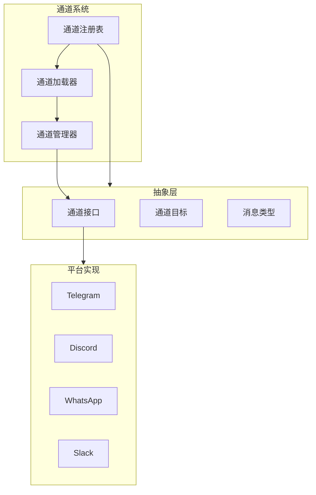
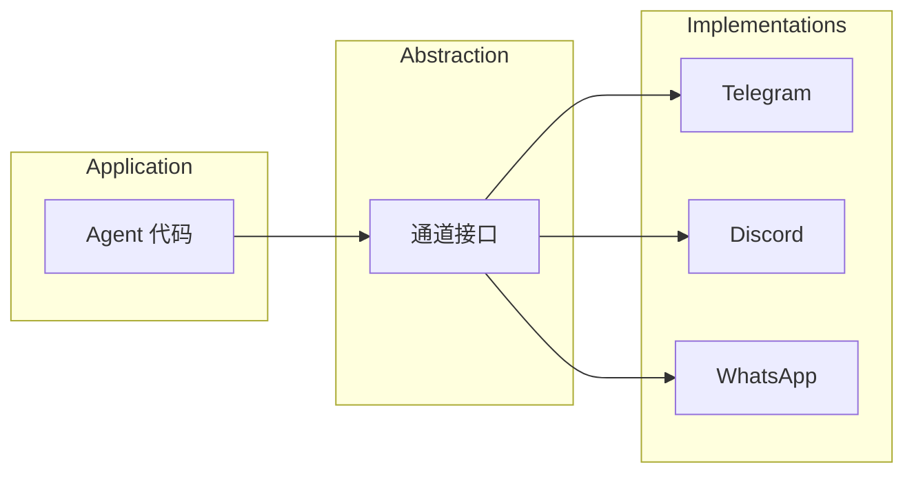
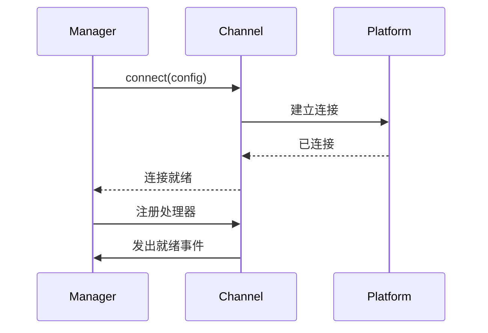
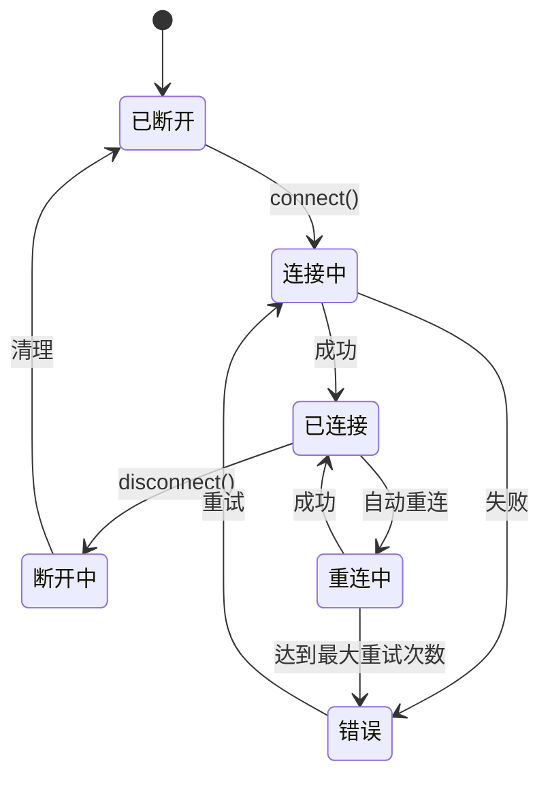

# 通道架构

## 概述

OpenClaw 使用通道抽象层来统一消息平台，提供一致的接口。



## 通道抽象的目的

### 为什么需要抽象？

| 优势 | 描述 |
|---------|-------------|
| 统一性 | 单一 API 访问所有平台 |
| 可扩展性 | 通过插件添加平台 |
| 一致性 | 跨通道行为一致 |
| 可测试性 | 在测试中模拟通道 |

### 抽象层次



## 通道注册表

### 注册表接口

```typescript
interface ChannelRegistry {
  // 注册
  register(channel: ChannelPlugin): void;
  unregister(id: string): void;

  // 查询
  get(id: string): ChannelPlugin | undefined;
  getByPlatform(platform: string): ChannelPlugin | undefined;
  list(): ChannelPlugin[];
  listEnabled(): ChannelPlugin[];

  // 状态
  isConnected(id: string): boolean;
  getStatus(id: string): ChannelStatus;
}

interface ChannelStatus {
  id: string;
  connected: boolean;
  users: number;
  lastMessage?: Date;
  error?: string;
}
```

### 注册表操作

```typescript
// 注册通道插件
registry.register({
  id: "telegram",
  name: "Telegram",
  platform: "telegram",
  entry: "./dist/index.js",
});

// 获取通道
const telegram = registry.get("telegram");

// 列出所有通道
const channels = registry.list();

// 检查状态
if (registry.isConnected("telegram")) {
  console.log("Telegram 已连接");
}
```

## 通道管理器

### 管理器职责

```typescript
class ChannelManager {
  private channels = new Map<string, ChannelInstance>();
  private registry: ChannelRegistry;

  // 生命周期
  async connect(channelId: string, config: ChannelConfig): Promise<void>;
  async disconnect(channelId: string): Promise<void>;
  async reconnect(channelId: string): Promise<void>;

  // 消息
  async send(channelId: string, target: Target, message: OutboundMessage): Promise<void>;

  // 健康检查
  async healthCheck(channelId: string): Promise<ChannelHealth>;
  async reconnectAll(): Promise<void>;
}
```

### 连接管理



## 能力系统

### 能力接口

```typescript
interface ChannelCapabilities {
  // 文本
  supportsText: boolean;
  supportsMarkdown: boolean;
  supportsHtml: boolean;

  // 媒体
  supportsImages: boolean;
  supportsVideos: boolean;
  supportsAudio: boolean;
  supportsFiles: boolean;

  // 交互
  supportsButtons: boolean;
  supportsInlineButtons: boolean;
  supportsReactions: boolean;
  supportsThreads: boolean;

  // 高级
  supportsReplies: boolean;
  supportsForwarding: boolean;
  supportsEphemeral: boolean;
}
```

### 能力示例

| 通道 | 图片 | 按钮 | 线程 | 反应 |
|---------|--------|---------|---------|-----------|
| Telegram | 是 | 是（内联） | 是 | 是 |
| Discord | 是 | 是（组件） | 是 | 是 |
| WhatsApp | 是 | 否 | 否 | 是 |
| Slack | 是 | 是（块） | 是 | 是 |
| Matrix | 是 | 否 | 是 | 是 |

### 能力检查

```typescript
async function sendWithFallback(
  channel: Channel,
  target: Target,
  message: OutboundMessage
): Promise<void> {
  // 检查通道是否支持按钮
  if (message.buttons && !channel.capabilities.supportsInlineButtons) {
    // 回退：转换为文本
    message.content = formatButtonsAsText(message.buttons);
    message.buttons = undefined;
  }

  // 检查内容是否需要截断
  if (message.content.length > channel.capabilities.maxMessageLength) {
    message.content = truncate(message.content, channel.capabilities.maxMessageLength);
  }

  await channel.send(target, message);
}
```

## 通道配置

### 配置模式

```typescript
interface ChannelConfig {
  enabled: boolean;
  polling?: PollingConfig;
  webhook?: WebhookConfig;
  commands?: CommandConfig[];
  filters?: FilterConfig[];
  rateLimit?: RateLimitConfig;
}

interface PollingConfig {
  enabled: boolean;
  interval?: number;
  timeout?: number;
}

interface WebhookConfig {
  enabled: boolean;
  path: string;
  secret?: string;
}
```

### 通道特定配置

```typescript
const telegramConfig: ChannelConfig = {
  enabled: true,
  polling: {
    enabled: true,
    interval: 1000,
  },
  commands: [
    { command: "start", description: "启动机器人" },
    { command: "help", description: "获取帮助" },
  ],
  filters: {
    allowlist: ["123456789"],  // 允许的用户 ID
  },
};

const discordConfig: ChannelConfig = {
  enabled: true,
  webhook: {
    enabled: true,
    path: "/webhook/discord",
  },
  commands: [
    { command: "!", prefix: true },
  ],
};
```

## 通道生命周期

### 生命周期状态



### 错误恢复

```typescript
class ChannelConnection {
  private reconnectAttempts = 0;
  private readonly maxRetries = 5;

  async connect(): Promise<void> {
    try {
      await this.platform.connect();
      this.reconnectAttempts = 0;
      this.emit("connected");
    } catch (error) {
      this.handleConnectionError(error);
    }
  }

  private async handleConnectionError(error: Error): Promise<void> {
    this.emit("error", error);

    if (this.reconnectAttempts < this.maxRetries) {
      this.reconnectAttempts++;
      const delay = Math.min(1000 * Math.pow(2, this.reconnectAttempts), 30000);
      await sleep(delay);
      await this.connect();
    } else {
      this.emit("failed", error);
    }
  }
}
```

## 相关

- [通道抽象](./02-channel-abstract) - 接口定义
- [入站事件](./03-inbound-events) - 事件处理
- [消息处理](./04-message-processing) - 处理管道