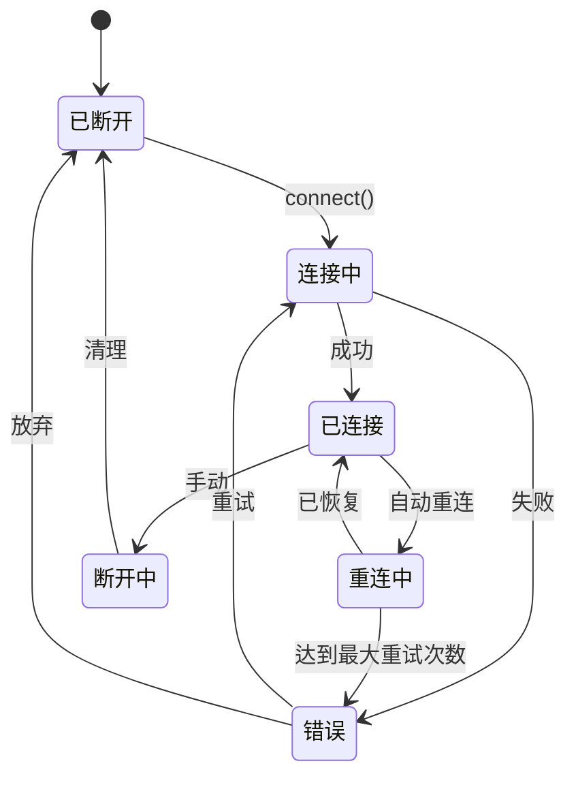

# 通道抽象

## 概述

通道抽象层定义了所有通道实现必须遵循的接口契约。

## 通道接口

### 核心接口

```typescript
interface Channel {
  readonly id: string;
  readonly name: string;
  readonly platform: string;
  readonly capabilities: ChannelCapabilities;

  // 生命周期
  connect(config: ChannelConfig): Promise<void>;
  disconnect(): Promise<void>;
  isConnected(): boolean;

  // 消息
  send(target: ChannelTarget, message: OutboundMessage): Promise<void>;
  editMessage(target: ChannelTarget, messageId: string, content: string): Promise<void>;
  deleteMessage(target: ChannelTarget, messageId: string): Promise<void>;

  // 媒体
  uploadMedia(data: Buffer, type: MediaType): Promise<MediaId>;
  resolveMediaUrl(mediaId: MediaId): Promise<string>;

  // 事件
  onMessage(handler: MessageHandler): void;
  onEdit(handler: EditHandler): void;
  onDelete(handler: DeleteHandler): void;
  onReaction(handler: ReactionHandler): void;
  onCommand(handler: CommandHandler): void;
}
```

### 通道目标

```typescript
interface ChannelTarget {
  channel: string;     // 通道 ID（例如 "telegram"）
  peer: string;       // 对端 ID（例如 "123456789"）
  peerType: PeerType; // "user", "group", "channel"
}

type PeerType = "user" | "group" | "channel" | "bot";
```

### 出站消息

```typescript
interface OutboundMessage {
  content?: string;
  media?: MediaAttachment;
  buttons?: InlineButton[][];
  format?: "markdown" | "html" | "plain";
  replyTo?: string;
  replyInThread?: string;
  ephemeral?: boolean;
}

interface InlineButton {
  label: string;
  data?: string;        // 回调数据
  url?: string;         // URL 按钮
  style?: "primary" | "secondary";
}
```

## 消息处理器

### 处理器接口

```typescript
type MessageHandler = (
  message: InboundMessage
) => void | Promise<void>;

interface InboundMessage {
  id: string;
  channel: string;
  peer: string;
  peerType: PeerType;
  sender: Sender;
  content: string;
  media?: MediaAttachment;
  timestamp: Date;
  replyTo?: string;
  threadId?: string;
  metadata: MessageMetadata;
}

interface Sender {
  id: string;
  name: string;
  username?: string;
  mention?: string;
  isBot: boolean;
}
```

### 处理器示例

```typescript
// 注册消息处理器
channel.onMessage(async (message) => {
  console.log(`收到来自 ${message.sender.name} 的消息: ${message.content}`);

  // 处理消息
  const response = await agent.process(message.content);

  // 发送响应
  await channel.send(
    { channel: message.channel, peer: message.peer, peerType: message.peerType },
    { content: response }
  );
});
```

## 账户管理

### 账户接口

```typescript
interface ChannelAccount {
  id: string;
  channel: string;
  username?: string;
  displayName?: string;
  isBot: boolean;
  permissions?: string[];
}

interface AccountManager {
  // 账户信息
  getAccount(channelId: string): Promise<ChannelAccount | null>;

  // Bot 信息
  getBotInfo(channelId: string): Promise<BotInfo | null>;

  // 对端信息
  getPeerInfo(channelId: string, peer: string): Promise<PeerInfo | null>;

  // 权限
  hasPermission(channelId: string, peer: string, permission: string): Promise<boolean>;
}
```

### 对端信息

```typescript
interface PeerInfo {
  id: string;
  type: PeerType;
  name: string;
  username?: string;

  // 群组特定
  memberCount?: number;
  isAdmin?: boolean;
  permissions?: string[];

  // 频道特定
  subscriberCount?: number;
  isMember?: boolean;
}
```

## 连接状态

### 状态机



### 状态处理

```typescript
interface ChannelState {
  status: ConnectionStatus;
  connectedAt?: Date;
  lastMessageAt?: Date;
  error?: ConnectionError;
  retryCount: number;
}

type ConnectionStatus =
  | "disconnected"
  | "connecting"
  | "connected"
  | "reconnecting"
  | "error";

interface ConnectionError {
  code: string;
  message: string;
  retryable: boolean;
  retryAfter?: number;
}
```

### 状态监听器

```typescript
channel.on("connecting", () => {
  console.log("正在连接通道...");
});

channel.on("connected", () => {
  console.log("已连接到通道");
});

channel.on("disconnected", (reason) => {
  console.log("已断开:", reason);
});

channel.on("error", (error) => {
  console.error("通道错误:", error);
  if (error.retryable) {
    console.log(`将在 ${error.retryAfter}ms 后重试`);
  }
});
```

## 消息类型

### 媒体附件

```typescript
interface MediaAttachment {
  id: string;
  type: MediaType;
  url?: string;
  mimeType: string;
  size?: number;

  // 图片
  width?: number;
  height?: number;

  // 音频/视频
  duration?: number;

  // 文件
  filename?: string;

  // 缩略图
  thumbnailUrl?: string;
  thumbnailWidth?: number;
  thumbnailHeight?: number;
}

type MediaType = "image" | "video" | "audio" | "document" | "sticker";
```

### 消息元数据

```typescript
interface MessageMetadata {
  // 来源
  channelId: string;
  originalId?: string;      // 原始消息 ID（用于编辑/反应）

  // 线程
  threadId?: string;
  isThreadRoot?: boolean;

  // 反应
  reactions?: Reaction[];

  // 编辑
  editedAt?: Date;
  editedBy?: string;

  // 转发
  forwardedFrom?: {
    channel: string;
    messageId: string;
  };

  // 命令
  command?: string;
  commandArgs?: string[];

  // 回调
  callbackId?: string;
  callbackData?: string;
}
```

## 通道事件

### 事件类型

```typescript
interface ChannelEvents {
  onMessage(handler: MessageHandler): void;
  onEdit(handler: EditHandler): void;
  onDelete(handler: DeleteHandler): void;
  onReaction(handler: ReactionHandler): void;
  onCommand(handler: CommandHandler): void;
  onCallback(handler: CallbackHandler): void;

  // 连接事件
  onConnect(handler: () => void): void;
  onDisconnect(handler: (reason: string) => void): void;
  onError(handler: (error: Error) => void): void;
}

type EditHandler = (edit: MessageEdit) => void;
type DeleteHandler = (delete: MessageDelete) => void;
type ReactionHandler = (reaction: Reaction) => void;
type CommandHandler = (command: Command) => void;
type CallbackHandler = (callback: Callback) => void;
```

### 事件载荷

```typescript
interface MessageEdit {
  messageId: string;
  newContent: string;
  editedAt: Date;
  editor: Sender;
}

interface MessageDelete {
  messageId: string;
  deletedAt: Date;
  deletedBy?: Sender;
}

interface Reaction {
  messageId: string;
  userId: string;
  emoji: string;
  added: boolean;
}

interface Command {
  name: string;
  args: string[];
  message: InboundMessage;
}

interface Callback {
  id: string;
  data: string;
  messageId: string;
  user: Sender;
}
```

## 相关

- [通道架构](./01-channel-architecture) - 通道设计
- [入站事件](./03-inbound-events) - 事件处理
- [消息处理](./04-message-processing) - 处理管道