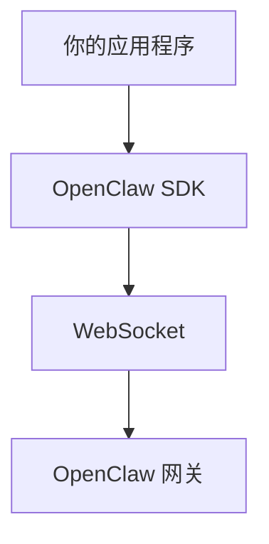

# App SDK

## 概述

App SDK (`@openclaw/sdk`) 提供了一个 TypeScript 客户端，用于连接 OpenClaw 网关。



## 安装

```bash
npm install @openclaw/sdk
# 或
pnpm add @openclaw/sdk
```

## 快速开始

```typescript
import { OpenClaw } from "@openclaw/sdk";

const client = new OpenClaw({
  url: "ws://127.0.0.1:18789",
  token: process.env.OPENCLAW_GATEWAY_TOKEN,
});

await client.connect();

const run = await client.agents.get("main").run({
  input: "你好，你怎么样？",
  sessionKey: "main",
});

for await (const event of run.events()) {
  if (event.type === "assistant.delta") {
    process.stdout.write(event.data.delta);
  }
}
```

## 客户端配置

### 配置选项

```typescript
interface OpenClawConfig {
  // 连接
  url: string;
  token?: string;
  password?: string;

  // 设备
  deviceId?: string;
  deviceName?: string;
  platform?: string;

  // 客户端信息
  clientName?: string;
  clientVersion?: string;

  // 超时
  connectTimeout?: number;
  requestTimeout?: number;

  // 重试
  maxRetries?: number;

  // 调试
  debug?: boolean;
}

const client = new OpenClaw({
  url: "ws://127.0.0.1:18789",
  token: "sk-openclaw-xxxxx",
  deviceName: "my-app",
  platform: "node",
  requestTimeout: 60000,
});
```

## 连接管理

### 连接

```typescript
async function connect(): Promise<void> {
  await client.connect();

  // 或手动处理
  client.on("connected", () => {
    console.log("已连接到网关");
  });

  client.on("disconnected", (reason) => {
    console.log("已断开:", reason);
  });

  client.on("error", (error) => {
    console.error("连接错误:", error);
  });
}
```

### 连接事件

```typescript
client.on("connected", () => {
  console.log("已连接到网关");
});

client.on("disconnected", (reason) => {
  console.log("已断开:", reason);
});

client.on("error", (error) => {
  console.error("错误:", error);
});

client.on("reconnecting", (attempt) => {
  console.log("正在重连，尝试次数:", attempt);
});
```

## Agent 操作

### 运行 Agent

```typescript
// 简单运行
const run = await client.agents.get("main").run({
  input: "天气怎么样？",
  sessionKey: "main",
});

// 带选项
const run = await client.agents.get("main").run({
  input: "分析这段代码",
  modelRef: "anthropic:claude-opus-4",
  temperature: 0.7,
  sessionKey: "telegram:dm:123456",
});

// 遍历事件
for await (const event of run.events()) {
  switch (event.type) {
    case "start":
      console.log("运行开始:", event.runId);
      break;
    case "assistant.delta":
      process.stdout.write(event.delta);
      break;
    case "tool_use":
      console.log("工具调用:", event.tool);
      break;
    case "tool_result":
      console.log("工具结果:", event.result);
      break;
    case "complete":
      console.log("完成！摘要:", event.summary);
      break;
    case "error":
      console.error("错误:", event.error);
      break;
  }
}
```

### 运行事件

```typescript
type RunEvent =
  | { type: "start"; runId: string }
  | { type: "assistant.delta"; delta: string }
  | { type: "assistant.text"; text: string }
  | { type: "tool_use"; tool: string; input: unknown }
  | { type: "tool_result"; tool: string; result: unknown }
  | { type: "complete"; summary: string }
  | { type: "error"; error: string };
```

### Agent 管理

```typescript
// 列出 Agent
const agents = await client.agents.list();
// [{ id: "main", status: "active", sessions: 5 }, ...]

// 获取 Agent 信息
const agent = await client.agents.get("main");
// { id: "main", status: "active", sessions: 5, running: 2 }

// 中止运行中的 Agent
await client.agents.get("main").abort(runId);
```

## 会话操作

### 会话管理

```typescript
// 获取会话信息
const session = await client.sessions.get("main");
// {
//   key: "main",
//   agentId: "main",
//   createdAt: Date,
//   messageCount: 42,
//   lastMessageAt: Date
// }

// 获取会话历史
const history = await client.sessions.getHistory("main", { limit: 50 });
// [{ role: "user", content: "...", timestamp: Date }, ...]

// 重置会话
await client.sessions.reset("main");

// 删除会话
await client.sessions.delete("main");
```

## 消息发送

### 发送消息

```typescript
// 发送到通道
await client.messages.send({
  channel: "telegram",
  target: "123456789",
  content: "你好，来自 OpenClaw SDK！",
});

// 带按钮发送
await client.messages.send({
  channel: "discord",
  target: "channel-id",
  content: "选择一个选项：",
  buttons: [
    [
      { label: "选项 A", data: "option_a" },
      { label: "选项 B", data: "option_b" }
    ]
  ]
});

// 回复消息
await client.messages.sendReply({
  channel: "telegram",
  target: "123456789",
  content: "回复你的消息",
  replyTo: "original-message-id"
});
```

## 事件订阅

### 订阅事件

```typescript
// 订阅所有事件
client.on("event", (event) => {
  console.log("网关事件:", event);
});

// 订阅特定事件
client.on("chat", (message) => {
  console.log("新聊天消息:", message);
});

client.on("presence", (presence) => {
  console.log("状态更新:", presence);
});

client.on("tick", (tick) => {
  console.log("网关心跳:", tick.health);
});

// 取消订阅
const handler = (message) => console.log(message);
client.on("chat", handler);
client.off("chat", handler);
```

### 聊天事件

```typescript
client.on("chat", (event) => {
  const { channel, target, message } = event;
  console.log(`${channel} 上的新消息:`, message.content);

  // message 包含:
  // - id: string
  // - from: { id, name, username }
  // - content: string
  // - timestamp: Date
  // - media?: MediaAttachment
});
```

## 健康和状态

### 获取状态

```typescript
// 健康检查
const health = await client.health.check();
// {
//   status: "healthy",
//   uptime: 86400,
//   memory: { used: 128, total: 512 },
//   channels: [...]
// }

// 系统状态
const status = await client.status.get();
// {
//   version: "1.0.0",
//   gateway: { status: "running" },
//   plugins: [...],
//   channels: [...]
// }

// 在线状态
const presence = await client.presence.get();
// {
//   channels: [{ id, status, users }],
//   agents: [{ id, status, sessions }]
// }
```

## 错误处理

### 错误类型

```typescript
try {
  const run = await client.agents.get("main").run({
    input: "你好",
    sessionKey: "main",
  });
} catch (error) {
  if (error instanceof OpenClawError) {
    switch (error.code) {
      case "AUTH_FAILED":
        console.error("认证失败");
        break;
      case "SESSION_NOT_FOUND":
        console.error("会话未找到");
        break;
      case "RATE_LIMITED":
        console.error("请求过于频繁，重试时间:", error.retryAfter);
        break;
      default:
        console.error("错误:", error.message);
    }
  }
}
```

### OpenClawError

```typescript
class OpenClawError extends Error {
  code: string;
  statusCode: number;
  retryAfter?: number;

  constructor(code: string, message: string, statusCode: number = 500) {
    super(message);
    this.name = "OpenClawError";
    this.code = code;
    this.statusCode = statusCode;
  }
}
```

## 流式响应

### 流式处理

```typescript
// 使用异步迭代
const run = client.agents.get("main").run({ input: "写一首诗" });

for await (const event of run.events()) {
  if (event.type === "assistant.delta") {
    process.stdout.write(event.delta);
  }
}

// 使用回调
run.on("delta", (delta) => {
  process.stdout.write(delta);
});

run.on("complete", (summary) => {
  console.log("\n\n摘要:", summary);
});
```

## 完整示例

```typescript
import { OpenClaw } from "@openclaw/sdk";

async function main() {
  const client = new OpenClaw({
    url: process.env.OPENCLAW_URL || "ws://127.0.0.1:18789",
    token: process.env.OPENCLAW_TOKEN,
    deviceName: "my-app",
  });

  // 连接
  await client.connect();
  console.log("已连接！");

  // 订阅传入消息
  client.on("chat", async (event) => {
    if (event.message.content.startsWith("/ask ")) {
      const question = event.message.content.slice(5);

      // 运行 Agent
      const run = await client.agents.get("main").run({
        input: question,
        sessionKey: `${event.channel}:dm:${event.message.from.id}`,
      });

      // 流式响应
      let response = "";
      for await (const e of run.events()) {
        if (e.type === "assistant.delta") {
          response += e.delta;
        }
      }

      // 发送回复
      await client.messages.send({
        channel: event.channel,
        target: event.target,
        content: response || "我没有答案。",
      });
    }
  });

  // 处理错误
  client.on("error", (error) => {
    console.error("错误:", error);
  });
}

main().catch(console.error);
```

## 相关

- [插件 SDK](./02-plugin-sdk.md) - 插件开发 SDK
- [Memory Host SDK](./03-memory-host-sdk.md) - 内存集成
- [API 参考](./04-api-reference.md) - 完整 API 参考