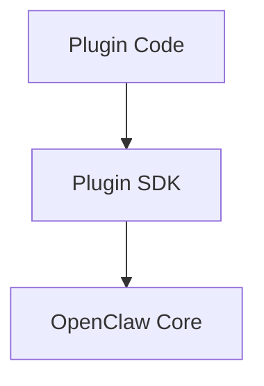

# 插件 SDK

## 概述

插件 SDK 提供用于构建 OpenClaw 插件（包括 provider、channel 和工具）的 API。

## SDK 结构



## 包导出

### 子路径导出

```typescript
// Core
import { pluginRuntime } from "@openclaw/plugin-sdk/runtime";
import { configRuntime } from "@openclaw/plugin-sdk/config";
import { testing } from "@openclaw/plugin-sdk/testing";

// Provider
import { providerEntry } from "@openclaw/plugin-sdk/runtime/provider";

// Channel
import { channelEntry } from "@openclaw/plugin-sdk/runtime/channel";

// Tool
import { toolEntry } from "@openclaw/plugin-sdk/runtime/tool";

// Memory
import { memoryEntry } from "@openclaw/plugin-sdk/runtime/memory";
```

## Provider SDK

### Provider 入口

```typescript
import { providerEntry } from "@openclaw/plugin-sdk/runtime/provider";

export const entry = providerEntry({
  id: "my-provider",
  name: "My Provider",

  async listModels(config) {
    return [
      {
        ref: "my-provider:model-1",
        name: "Model 1",
        provider: "my-provider",
        maxTokens: 4096,
        supportsStreaming: true,
        supportsFunctionCalling: true,
        contextWindow: 128000,
        maxOutputTokens: 4096,
      },
    ];
  },

  async createCompletion(config, params) {
    // Implementation
    return stream;
  },
});
```

### Completion 流式处理

```typescript
async createCompletion(config, params) {
  const stream = await this.client.complete({
    model: params.model.replace("my-provider:", ""),
    messages: params.messages,
    stream: true,
    max_tokens: params.maxTokens,
    temperature: params.temperature,
  });

  // Convert to async iterable
  return {
    async *[Symbol.asyncIterator]() {
      for await (const chunk of stream) {
        yield {
          delta: chunk.choices[0]?.delta?.content || "",
          usage: chunk.usage,
          done: chunk.choices[0]?.finish_reason === "stop",
        };
      }
    }
  };
}
```

## Channel SDK

### Channel 入口

```typescript
import { channelEntry } from "@openclaw/plugin-sdk/runtime/channel";

export const entry = channelEntry({
  id: "my-channel",
  name: "My Channel",

  async connect(config) {
    return new MyChannelClient(config);
  },

  async send(target, message, client) {
    await client.sendMessage(target.peer, message.content);
  },

  onMessage(client, handler) {
    client.on("message", (raw) => {
      const message = normalizeMessage(raw);
      handler(message);
    });
  },
});
```

### Channel 配置

```typescript
import { defineChannelConfig } from "@openclaw/plugin-sdk/config";

export const config = defineChannelConfig({
  apiKey: {
    type: "secret",
    required: true,
    description: "API key for My Channel",
  },
  botUsername: {
    type: "string",
    required: true,
  },
  webhookSecret: {
    type: "secret",
    required: false,
  },
});
```

## Tool SDK

### Tool 入口

```typescript
import { toolEntry } from "@openclaw/plugin-sdk/runtime/tool";

export const entry = toolEntry({
  id: "my-tool",
  name: "My Tool",
  tools: [
    {
      name: "my_action",
      description: "Perform a custom action",
      schema: {
        type: "object",
        properties: {
          param1: { type: "string", description: "First parameter" },
          param2: { type: "number", description: "Second parameter" },
        },
        required: ["param1"],
      },
    },
  ],

  async execute(tool, params, context) {
    if (tool.name === "my_action") {
      const result = await performAction(params.param1, params.param2);
      return {
        success: true,
        content: { type: "text", text: JSON.stringify(result) },
      };
    }
    throw new Error(`Unknown tool: ${tool.name}`);
  },
});
```

### Tool Schema

```typescript
const toolSchema = {
  type: "object",
  properties: {
    query: {
      type: "string",
      description: "Search query",
    },
    limit: {
      type: "number",
      description: "Maximum results",
      default: 10,
      minimum: 1,
      maximum: 100,
    },
    filter: {
      type: "object",
      properties: {
        category: { type: "string" },
        tags: { type: "array", items: { type: "string" } },
      },
    },
  },
  required: ["query"],
};
```

## 运行时 API

### 插件上下文

```typescript
interface PluginContext {
  config: Readonly<PluginConfig>;
  secrets: SecretsManager;
  logger: Logger;
  state: PluginState;
  hooks: HooksAPI;
}

// Access in entry
export const entry = providerEntry({
  async activate(context: PluginContext) {
    const { config, secrets, logger, state, hooks } = context;

    // Get secret
    const apiKey = await secrets.get("API_KEY");

    // Log
    logger.info("Plugin activated");

    // Store state
    state.client = new Client(apiKey);

    // Register hooks
    hooks.on("before:message", myHook);
  },
});
```

### 密钥管理器

```typescript
interface SecretsManager {
  get(key: string): Promise<string>;
  getOptional(key: string): Promise<string | undefined>;
  list(): Promise<string[]>;
}

// Usage
const apiKey = await context.secrets.get("API_KEY");
const webhookSecret = await context.secrets.getOptional("WEBHOOK_SECRET");
```

### 日志记录器

```typescript
interface Logger {
  debug(message: string, meta?: object): void;
  info(message: string, meta?: object): void;
  warn(message: string, meta?: object): void;
  error(message: string, error?: Error, meta?: object): void;
}

// Usage
logger.info("Processing request", { userId: "123" });
logger.error("Request failed", error, { userId: "123" });

// Child logger
const childLogger = logger.child({ plugin: "my-plugin" });
childLogger.info("Message from plugin");
```

### Hooks API

```typescript
interface HooksAPI {
  on(event: string, handler: HookHandler): void;
  off(event: string, handler: HookHandler): void;
}

// Hook types
type HookHandler = (data: unknown) => void | Promise<void>;

// Available hooks
const HOOKS = {
  "before:message": MessageHook,
  "after:message": MessageHook,
  "before:tool": ToolHook,
  "after:tool": ToolHook,
  "before:agent": AgentHook,
  "after:agent": AgentHook,
};

// Usage
hooks.on("before:message", async (message) => {
  // Modify or validate message
  return message;
});

hooks.on("after:tool", async (result) => {
  // Log or modify result
  logger.info("Tool executed", { result });
});
```

## 配置

### 配置定义

```typescript
import { defineConfig } from "@openclaw/plugin-sdk/config";

export const config = defineConfig({
  // String config
  apiUrl: {
    type: "string",
    default: "https://api.example.com",
    description: "API base URL",
  },

  // Number config
  timeout: {
    type: "number",
    default: 30000,
    minimum: 1000,
    maximum: 120000,
  },

  // Boolean config
  debug: {
    type: "boolean",
    default: false,
  },

  // Enum config
  logLevel: {
    type: "string",
    default: "info",
    enum: ["debug", "info", "warn", "error"],
  },

  // Secret config
  apiKey: {
    type: "secret",
    required: true,
    description: "API key for authentication",
  },

  // Object config
  options: {
    type: "object",
    properties: {
      retries: { type: "number" },
      region: { type: "string" },
    },
  },
});
```

### 配置运行时

```typescript
import { configRuntime } from "@openclaw/plugin-sdk/config";

// Get current config
const config = configRuntime.get();

// Watch for config changes
configRuntime.onChange((newConfig) => {
  logger.info("Config updated", { newConfig });
  // Reinitialize with new config
});

// Validate config
const result = configSchema.safeParse(rawConfig);
if (!result.success) {
  throw new ConfigError(result.error);
}
```

## 测试

### 测试辅助函数

```typescript
import {
  createTestPlugin,
  mockContext,
  mockProvider,
} from "@openclaw/plugin-sdk/testing";

describe("My Plugin", () => {
  let plugin: TestPlugin;

  beforeEach(() => {
    plugin = createTestPlugin({
      manifest: testManifest,
      entry: myPluginEntry,
    });
  });

  it("should activate", async () => {
    const ctx = mockContext({
      config: { apiKey: "test-key" },
    });

    await plugin.activate(ctx);
    expect(plugin.status).toBe("active");
  });

  it("should list models", async () => {
    const ctx = mockContext();
    await plugin.activate(ctx);

    const models = await plugin.module.listModels();
    expect(models).toHaveLength(2);
  });
});
```

### 模拟上下文

```typescript
const ctx = mockContext({
  config: {
    apiKey: "test-key",
    timeout: 5000,
  },
  secrets: {
    get: async (key) => {
      if (key === "API_KEY") return "mock-api-key";
      throw new Error(`Unknown secret: ${key}`);
    },
  },
  logger: {
    info: vi.fn(),
    error: vi.fn(),
    warn: vi.fn(),
    debug: vi.fn(),
  },
  state: {},
});
```

## 完整示例

```typescript
import { providerEntry } from "@openclaw/plugin-sdk/runtime/provider";
import { defineConfig } from "@openclaw/plugin-sdk/config";

export const config = defineConfig({
  apiKey: { type: "secret", required: true },
  model: { type: "string", default: "default-model" },
});

export const entry = providerEntry({
  id: "my-provider",
  name: "My Provider",
  config,

  async activate(context) {
    const { config, secrets, logger } = context;
    const apiKey = await secrets.get("API_KEY");

    logger.info("Activating My Provider");
    context.state.client = new Client({ apiKey });
  },

  async listModels() {
    return [
      {
        ref: "my-provider:default-model",
        name: "Default Model",
        provider: "my-provider",
        maxTokens: 4096,
        supportsStreaming: true,
        contextWindow: 128000,
        maxOutputTokens: 4096,
      },
    ];
  },

  async createCompletion(config, params) {
    const client = this.state.client;
    return client.complete({
      model: config.model,
      messages: params.messages,
      stream: params.stream ?? true,
    });
  },
});
```

## 相关内容

- [App SDK](./01-app-sdk.md) - 客户端 SDK
- [插件架构](../part-3-plugin-system/01-plugin-architecture.md) - 插件设计
- [编写插件](../part-3-plugin-system/05-writing-plugins.md) - 插件开发
