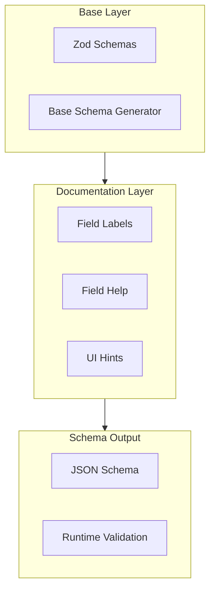

# 配置 Schema

## 概述

OpenClaw 使用分层配置 Schema 系统，将基础 Schema 生成、字段文档和运行时验证分离。该系统为 UI 消费生成 JSON Schema，同时使用 Zod 进行 TypeScript 级别的验证。



## Schema 架构

### 层级分离

| 层级 | 用途 | 文件 |
|-------|---------|-------|
| 基础 | 定义类型的 Zod Schema | `zod-schema.ts` |
| 文档 | 标签和帮助文本 | `schema.labels.ts`, `schema.help.ts` |
| 提示 | UI 元数据 | `schema.hints.ts` |
| 输出 | 组合 JSON Schema | `schema.ts` |

### 配置结构

```typescript
// Main config entry
interface OpenClawConfig {
  meta?: MetaConfig;
  env?: EnvConfig;
  wizard?: WizardConfig;
  diagnostics?: DiagnosticsConfig;
  logging?: LoggingConfig;
  cli?: CliConfig;
  update?: UpdateConfig;
  commitments?: CommitmentsConfig;
  agents?: AgentsConfig;
  gateway?: GatewayConfig;
  browser?: BrowserConfig;
  tools?: ToolsConfig;
  channels?: Record<string, ChannelConfig>;
  plugins?: Record<string, PluginConfig>;
  talk?: TalkConfig;
  acp?: AcpConfig;
}
```

### Schema 生成

```typescript
// Base schema response shape
interface BaseConfigSchemaResponse {
  schema: ConfigSchema;
  uiHints: ConfigUiHints;
}

// Full schema response with metadata
interface ConfigSchemaResponse {
  schema: ConfigSchema;
  uiHints: ConfigUiHints;
  version: string;
  generatedAt: string;
}
```

## 字段文档

### 标签

字段标签为配置路径提供人类可读的标题：

```typescript
// schema.labels.ts
export const FIELD_LABELS: Record<string, string> = {
  gateway: "Gateway",
  "gateway.port": "Gateway Port",
  "gateway.auth": "Gateway Auth",
  "gateway.auth.mode": "Gateway Auth Mode",
  agents: "Agents",
  "agents.list": "Agent List",
  "agents.defaults": "Agent Defaults",
  // ...
};
```

### 帮助文本

字段描述解释用途和用法：

```typescript
// schema.help.ts
export const FIELD_HELP: Record<string, string> = {
  gateway:
    "Gateway runtime surface for bind mode, auth, control UI, remote transport, and operational safety controls.",
  "gateway.port":
    "TCP port used by the gateway listener for API, control UI, and channel-facing ingress paths.",
  "gateway.auth":
    "Authentication policy for gateway HTTP/WebSocket access including mode, credentials, trusted-proxy behavior, and rate limiting.",
  // ...
};
```

## 配置路径

### 点号路径表示法

配置路径使用点号表示法处理嵌套字段：

```
gateway.port
gateway.auth.mode
agents.list[].skills
tools.media.image.enabled
```

### 数组表示法

数组使用 `[]` 表示数组层级，使用 `[*]` 或编号索引表示特定项目：

```
agents.list[].skills         # All agent skills
agents.list[*].models.*      # All models for all agents
channels.telegram.botToken   # Specific channel config
```

## Schema 查找

### 查找 API

```typescript
// Look up schema for a specific path
interface ConfigSchemaLookupResult {
  path: string;
  schema: JsonSchemaNode;
  hint?: ConfigUiHint;
  hintPath?: string;
  children: ConfigSchemaLookupChild[];
}

// Child fields for a schema node
interface ConfigSchemaLookupChild {
  key: string;
  path: string;
  type?: string | string[];
  required: boolean;
  hasChildren: boolean;
  hint?: ConfigUiHint;
  hintPath?: string;
}
```

### 查找限制

Schema 查找系统强制执行安全限制：

```typescript
// Forbidden path segments (prototype pollution prevention)
const FORBIDDEN_LOOKUP_SEGMENTS = new Set([
  "__proto__",
  "prototype",
  "constructor"
]);

// Maximum path depth
const MAX_LOOKUP_PATH_SEGMENTS = 32;

// Maximum nested form depth
const LOOKUP_SCHEMA_NESTED_FORM_DEPTH = 4;
```

## UI 提示

### 提示类型

```typescript
interface ConfigUiHint {
  label?: string;         // Display label
  help?: string;          // Help text
  placeholder?: string;   // Input placeholder
  advanced?: boolean;     // Advanced field marker
  sensitive?: boolean;    // Sensitive field (masked)
  tags?: string[];        // Category tags
}
```

### 提示应用

提示根据 Schema 路径应用，支持通配符：

```typescript
// Apply hints to schema
applySensitiveHints(schema, hints);
applySensitiveUrlHints(schema, hints);

// Wildcard matching for arrays
"agents.list[].skills.*.name"  // Matches all skill names
"tools.media.image.*"           // Matches all image tool fields
```

## 配置验证

### Zod Schema 验证

```typescript
import { OpenClawSchema } from "./zod-schema.js";

// Validate config at runtime
const result = OpenClawSchema.safeParse(config);
if (!result.success) {
  // Handle validation errors
  console.error(result.error.format());
}
```

### 验证层级

| 层级 | 触发时机 | 错误处理 |
|-------|---------|----------------|
| CLI 参数 | 启动时 | 退出并显示消息 |
| 配置文件 | 加载时 | Doctor 警告 |
| 运行时 | Gateway 启动时 | 阻止启动 |
| 迁移 | 配置写入时 | 安全时自动修复 |

## 插件配置扩展

### 插件 Schema 贡献

插件可以扩展配置 Schema：

```typescript
interface PluginUiMetadata {
  id: string;
  name?: string;
  description?: string;
  configUiHints?: Record<
    string,
    Pick<ConfigUiHint, "label" | "help" | "tags" | "advanced" | "sensitive" | "placeholder">
  >;
  configSchema?: JsonSchemaNode;
}
```

### 扩展限制

插件 Schema 有大小限制以防止响应膨胀：

```typescript
const EXTENSION_SCHEMA_MAX_BYTES = 256 * 1024;     // 256KB per plugin
const EXTENSION_SCHEMA_TOTAL_MAX_BYTES = 2 * 1024 * 1024;  // 2MB total
const EXTENSION_SCHEMA_MAX_ITEMS = 256;            // Max 256 plugins
```

### 省略的 Schema

当插件 Schema 超出限制时，会被替换：

```typescript
// Omitted schema placeholder
{
  type: "object",
  additionalProperties: true,
  description: "plugin config schema for ${id} was omitted..."
}
```

## 相关内容

- [配置参考](./04-api-reference.md) - 完整配置参考
- [Gateway 配置](../part-2-core-modules/01-gateway.md) - Gateway 设置
- [Agent 配置](../part-2-core-modules/02-agents.md) - Agent 配置
