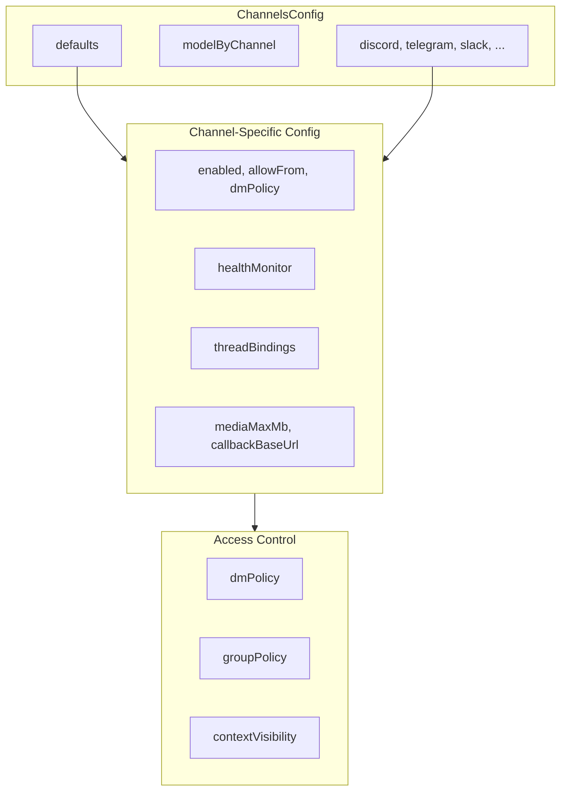
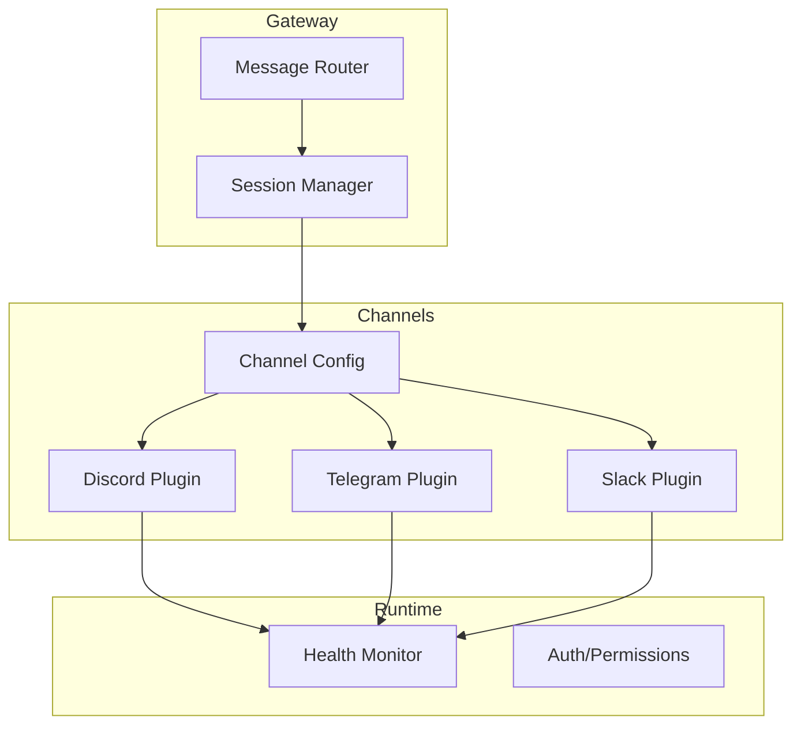

# Channel 配置

## 概述

OpenClaw 的 Channel 配置系统管理消息平台集成。每个 Channel 都有自己的配置命名空间，包含平台特定设置、访问控制和路由选项。



## 配置结构

### 主 Channels 配置

```typescript
// src/config/types.channels.ts
interface ChannelsConfig {
  /** Default settings applied to all channels. */
  defaults?: ChannelDefaultsConfig;
  /** Per-channel model overrides (provider -> channelId -> modelRef). */
  modelByChannel?: ChannelModelByChannelConfig;
  /** Platform-specific configurations. */
  discord?: DiscordConfig;
  googlechat?: GoogleChatConfig;
  imessage?: IMessageConfig;
  irc?: IrcConfig;
  msteams?: MSTeamsConfig;
  signal?: SignalConfig;
  slack?: SlackConfig;
  telegram?: TelegramConfig;
  whatsapp?: WhatsAppConfig;
  /** Plugin-owned channel configs keyed by arbitrary channel ids. */
  [key: string]: any;
}
```

### Channel 默认值

```typescript
interface ChannelDefaultsConfig {
  /** Default group policy. */
  groupPolicy?: GroupPolicy;
  /** Default context visibility. */
  contextVisibility?: ContextVisibilityMode;
  /** Default heartbeat visibility. */
  heartbeat?: ChannelHeartbeatVisibilityConfig;
  /** Default bot loop protection. */
  botLoopProtection?: ChannelBotLoopProtectionConfig;
}
```

## 通用 Channel 设置

### 访问控制

```typescript
interface ExtensionChannelConfig {
  /** Enable or disable the channel. */
  enabled?: boolean;
  /** Sender allowlist (user ids or patterns). */
  allowFrom?: Array<string | number>;
  /** Default delivery target for CLI --deliver. */
  defaultTo?: string | number;
  /** Default account when multiple are configured. */
  defaultAccount?: string;
  /** Direct message policy (pairing, all, none). */
  dmPolicy?: string;
  /** Group conversation policy. */
  groupPolicy?: GroupPolicy;
  /** Message context visibility. */
  contextVisibility?: ContextVisibilityMode;
}
```

### 健康监控

```typescript
interface ChannelHealthMonitorConfig {
  /** Enable health monitoring. */
  enabled?: boolean;
  /** Health check interval in seconds. */
  intervalSeconds?: number;
  /** Timeout for health checks. */
  timeoutSeconds?: number;
  /** Number of consecutive failures before unhealthy. */
  failureThreshold?: number;
}
```

### 线程绑定

```typescript
interface SessionThreadBindingsConfig {
  /** Enable session threading. */
  enabled?: boolean;
  /** Spawn sessions for new threads. */
  spawnSessions?: boolean;
  /** Default context mode for spawned sessions. */
  defaultSpawnContext?: "isolated" | "fork";
  /** @deprecated Use spawnSessions. */
  spawnAcpSessions?: boolean;
  /** @deprecated Use spawnSessions. */
  spawnSubagentSessions?: boolean;
}
```

## 平台特定配置

### Discord

```typescript
// src/config/types.discord.ts
interface DiscordConfig extends ExtensionChannelConfig {
  /** Bot token for authentication. */
  botToken?: SecretInput;
  /** Application ID for Discord API. */
  applicationId?: string;
  /** Guild-specific configurations. */
  guilds?: Record<string, DiscordGuildEntry>;
  /** Direct message settings. */
  dm?: DiscordDmConfig;
  /** Action permissions (reactions, stickers, etc.). */
  actions?: DiscordActionConfig;
  /** Streaming mode (off, partial, block, progress). */
  streamMode?: DiscordStreamMode;
  /** Reaction notification mode. */
  reactionNotifications?: DiscordReactionNotificationMode;
  /** PluralKit integration. */
  pluralKit?: DiscordPluralKitConfig;
  /** Mention aliases for bot commands. */
  mentionAliases?: DiscordMentionAliasesConfig;
}
```

### Discord Guild 配置

```typescript
interface DiscordGuildEntry {
  slug?: string;
  requireMention?: boolean;
  ignoreOtherMentions?: boolean;
  tools?: GroupToolPolicyConfig;
  toolsBySender?: GroupToolPolicyBySenderConfig;
  reactionNotifications?: DiscordReactionNotificationMode;
  users?: string[];
  roles?: string[];
  channels?: Record<string, DiscordGuildChannelConfig>;
}

interface DiscordGuildChannelConfig {
  requireMention?: boolean;
  ignoreOtherMentions?: boolean;
  tools?: GroupToolPolicyConfig;
  skills?: string[];
  enabled?: boolean;
  users?: string[];
  roles?: string[];
  systemPrompt?: string;
  includeThreadStarter?: boolean;
  autoThread?: boolean;
  autoArchiveDuration?: "60" | "1440" | "4320" | "10080";
  autoThreadName?: "message" | "generated";
}
```

### Telegram

```typescript
// src/config/types.telegram.ts
interface TelegramConfig extends ExtensionChannelConfig {
  /** Bot token from @BotFather. */
  botToken?: SecretInput;
  /** API ID for MTProto authentication. */
  apiId?: string | number;
  /** API Hash for MTProto authentication. */
  apiHash?: string;
  /** Session string for existing account. */
  sessionString?: SecretInput;
  /** Phone number for new session. */
  phone?: string;
  /** Action permissions. */
  actions?: TelegramActionConfig;
  /** Thread bindings. */
  threadBindings?: TelegramThreadBindingsConfig;
  /** Network settings. */
  network?: TelegramNetworkConfig;
  /** Streaming mode. */
  streamMode?: TelegramStreamingMode;
  /** Inline button visibility scope. */
  inlineButtonsScope?: TelegramInlineButtonsScope;
  /** Exec approval configuration. */
  execApproval?: TelegramExecApprovalConfig;
  /** Capabilities override. */
  capabilities?: TelegramCapabilitiesConfig;
}
```

### Slack

```typescript
// src/config/types.slack.ts
interface SlackConfig extends ExtensionChannelConfig {
  /** Bot token for authentication. */
  botToken?: SecretInput;
  /** Signing secret for request verification. */
  signingSecret?: SecretInput;
  /** App token for Socket Mode. */
  appToken?: SecretInput;
  /** Socket Mode connection. */
  socketMode?: boolean;
  /** Workspace allowlist. */
  allowFrom?: string[];
  /** Channel-specific configs. */
  channels?: Record<string, SlackChannelConfig>;
}
```

## 模型路由

### Channel 模型覆盖

为特定 Channel 覆盖默认模型：

```typescript
// Channel model configuration
interface ChannelModelByChannelConfig {
  // provider -> channelId -> modelRef
  [provider: string]: Record<string, string>;
}

// Example: Use different models per channel
{
  "channels": {
    "modelByChannel": {
      "anthropic": {
        "discord:guild1:channel1": "claude-opus-4",
        "discord:guild1:channel2": "claude-sonnet-4"
      },
      "openai": {
        "telegram:default": "gpt-4o"
      }
    }
  }
}
```

## 媒体配置

### 通用媒体设置

```typescript
interface MediaConfig {
  /** Maximum file size in MB. */
  mediaMaxMb?: number;
  /** Callback base URL for webhooks. */
  callbackBaseUrl?: string;
  /** Preserve original filenames. */
  preserveFilenames?: boolean;
  /** Retention period in hours. */
  ttlHours?: number;
}
```

### 按 Channel 的媒体限制

```typescript
// Set media limits per channel
{
  "channels": {
    "discord": {
      "mediaMaxMb": 25
    },
    "telegram": {
      "mediaMaxMb": 50
    }
  }
}
```

## 健康和监控

### Channel 心跳可见性

```typescript
interface ChannelHeartbeatVisibilityConfig {
  /** Show heartbeat in messages. */
  showInMessages?: boolean;
  /** Show in channel status. */
  showInStatus?: boolean;
}
```

### Bot 循环保护

防止 Channel 中的无限循环：

```typescript
interface ChannelBotLoopProtectionConfig {
  /** Enable loop detection. */
  enabled?: boolean;
  /** Messages per time window. */
  maxPerWindow?: number;
  /** Window duration in seconds. */
  windowSeconds?: number;
}
```

## 集成架构



## 示例配置

### 完整 Discord 配置

```json
{
  "channels": {
    "defaults": {
      "groupPolicy": "allowlist",
      "contextVisibility": "channel",
      "heartbeat": {
        "showInMessages": true,
        "showInStatus": true
      }
    },
    "discord": {
      "botToken": { "env": "DISCORD_BOT_TOKEN" },
      "guilds": {
        "123456789": {
          "requireMention": true,
          "users": ["987654321"],
          "roles": ["111222333"],
          "channels": {
            "general": {
              "requireMention": false,
              "enabled": true
            },
            "ai-chat": {
              "requireMention": true,
              "autoThread": true,
              "autoArchiveDuration": "1440"
            }
          }
        }
      },
      "dm": {
        "enabled": true,
        "policy": "pairing"
      },
      "actions": {
        "reactions": true,
        "stickers": true,
        "threads": true
      }
    }
  }
}
```

### 完整 Telegram 配置

```json
{
  "channels": {
    "telegram": {
      "botToken": { "env": "TELEGRAM_BOT_TOKEN" },
      "actions": {
        "reactions": true,
        "sendMessage": true,
        "poll": true
      },
      "threadBindings": {
        "enabled": true,
        "spawnSessions": true,
        "defaultSpawnContext": "isolated"
      },
      "network": {
        "autoSelectFamily": true,
        "dnsResultOrder": "ipv4first"
      },
      "streamMode": "partial",
      "execApproval": {
        "enabled": "auto",
        "target": "dm"
      }
    }
  }
}
```

## 相关内容

- [配置 Schema](./01-config-schema.md) - Schema 架构
- [Channel 能力](../part-3-channels/01-capabilities.md) - 能力系统
- [健康监控](../part-2-core-modules/03-health.md) - 健康系统
