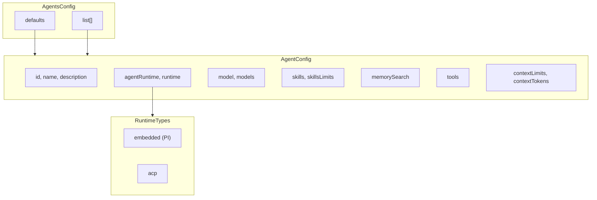

# Agent 配置

## 概述

OpenClaw 的 Agent 配置系统定义具有运行时策略、模型选择、工具和行为设置的 AI Agent。每个 Agent 都可以使用特定的能力和默认值进行自定义。



## 配置结构

### 主 Agents 配置

```typescript
// src/config/types.agents.ts
interface AgentsConfig {
  /** Default settings for all agents. */
  defaults?: AgentDefaultsConfig;
  /** Array of agent configurations. */
  list?: AgentConfig[];
}
```

### Agent 配置

```typescript
interface AgentConfig {
  /** Unique agent identifier. */
  id: string;
  /** Mark as the default agent. */
  default?: boolean;
  /** Human-readable name. */
  name?: string;
  /** Human-authored description. */
  description?: string;
  /** Workspace directory path. */
  workspace?: string;
  /** Agent directory path. */
  agentDir?: string;
  /** Full system prompt replacement. */
  systemPromptOverride?: string;
  /** Runtime policy override. */
  agentRuntime?: AgentRuntimePolicyConfig;
  /** @deprecated Use agentRuntime. */
  embeddedHarness?: AgentEmbeddedHarnessConfig;
  /** Model configuration. */
  model?: AgentModelConfig;
  /** Per-model metadata overrides. */
  models?: Record<string, AgentModelEntryConfig>;
  /** @deprecated Legacy compaction config. */
  compaction?: CompactionConfig;
  /** Default thinking level. */
  thinkingDefault?: ThinkingLevel;
  /** Default verbosity level. */
  verboseDefault?: "off" | "on" | "full";
  /** Tool progress detail mode. */
  toolProgressDetail?: ToolProgressDetailConfig;
  /** Default reasoning visibility. */
  reasoningDefault?: "on" | "off" | "stream";
  /** Default for fast mode. */
  fastModeDefault?: boolean;
  /** Bootstrap/context injection mode. */
  contextInjection?: ContextInjectionConfig;
  /** Max chars per bootstrap file. */
  bootstrapMaxChars?: number;
  /** Max chars across bootstrap files. */
  bootstrapTotalMaxChars?: number;
  /** Skills allowlist. */
  skills?: string[];
  /** Memory search configuration. */
  memorySearch?: MemorySearchConfig;
  /** Human-like delay settings. */
  humanDelay?: HumanDelayConfig;
  /** TTS overrides. */
  tts?: TtsConfig;
  /** Skills subsystem limits. */
  skillsLimits?: Pick<SkillsLimitsConfig, "maxSkillsPromptChars">;
  /** Context/token limit overrides. */
  contextLimits?: AgentContextLimitsConfig;
  /** Context window override. */
  contextTokens?: number;
  /** Heartbeat overrides. */
  heartbeat?: HeartbeatConfig;
  /** Identity configuration. */
  identity?: IdentityConfig;
  /** Group chat settings. */
  groupChat?: GroupChatConfig;
  /** Subagent configuration. */
  subagents?: SubagentConfig;
  /** Run loop retry boundaries. */
  runRetries?: RunRetriesConfig;
  /** Embedded Pi overrides. */
  embeddedPi?: EmbeddedPiConfig;
  /** Sandbox configuration. */
  sandbox?: AgentSandboxConfig;
  /** Stream parameters. */
  params?: Record<string, unknown>;
  /** Tools configuration. */
  tools?: AgentToolsConfig;
  /** Runtime descriptor. */
  runtime?: AgentRuntimeConfig;
}
```

## Agent 运行时

### 运行时类型

```typescript
// Embedded (PI) Runtime
type EmbeddedRuntime = { type: "embedded" };

// ACP Runtime
type AcpRuntime = {
  type: "acp";
  acp?: {
    agent?: string;      // Harness adapter id (codex, claude)
    backend?: string;    // ACP backend override
    mode?: "persistent" | "oneshot";
    cwd?: string;         // Working directory
  };
};

type AgentRuntimeConfig = EmbeddedRuntime | AcpRuntime;
```

### 运行时策略

```typescript
interface AgentRuntimePolicyConfig {
  /** Runtime type preference. */
  type?: "pi" | "codex" | "acp";
  /** Optional type override. */
  typeOverride?: "pi" | "codex" | "acp";
  /** ACP harness adapter id. */
  acpAgent?: string;
  /** ACP backend override. */
  acpBackend?: string;
  /** ACP session mode. */
  acpMode?: "persistent" | "oneshot";
  /** ACP working directory. */
  acpCwd?: string;
}
```

## 模型配置

### 模型选择

```typescript
interface AgentModelConfig {
  /** Primary model provider. */
  provider?: string;
  /** Primary model id. */
  model?: string;
  /** Fallback model chain. */
  fallbacks?: string[];
  /** Reasoning model override. */
  reasoning?: string;
  /** Reasoning model fallbacks. */
  reasoningFallbacks?: string[];
  /** System prompt for model. */
  systemPrompt?: string;
  /** Temperature setting. */
  temperature?: number;
  /** Maximum tokens. */
  maxTokens?: number;
  /** Thinking budget (when supported). */
  thinkingBudget?: number;
}
```

### 按模型覆盖

```typescript
interface AgentModelEntryConfig {
  /** Provider override. */
  provider?: string;
  /** Model id override. */
  model?: string;
  /** Fallback chain. */
  fallbacks?: string[];
  /** System prompt override. */
  systemPrompt?: string;
  /** Temperature override. */
  temperature?: number;
  /** Max tokens override. */
  maxTokens?: number;
}
```

## 思考级别

```typescript
type ThinkingLevel =
  | "off"        // No thinking
  | "minimal"    // Minimal reasoning
  | "low"        // Low reasoning effort
  | "medium"     // Medium reasoning
  | "high"       // High reasoning
  | "xhigh"      // Extra high reasoning
  | "adaptive"   // Adaptive based on query
  | "max";       // Maximum reasoning
```

## 工具配置

### 工具白名单

```typescript
interface AgentToolsConfig {
  /** Allowlist of tool names. */
  allow?: string[];
  /** Denylist of tool names. */
  deny?: string[];
  /** Also allow these tools (in addition to defaults). */
  alsoAllow?: string[];
  /** Custom tool definitions. */
  definitions?: ToolDefinition[];
}
```

### 组工具策略

```typescript
interface GroupToolPolicyConfig {
  /** Default policy for group messages. */
  default?: ToolPolicy;
  /** Per-sender tool policies. */
  bySender?: Record<string, ToolPolicy>;
}

type ToolPolicy = "allow" | "deny" | "ask";
```

## 内存配置

### 内存搜索设置

```typescript
interface MemorySearchConfig {
  /** Enable memory search. */
  enabled?: boolean;
  /** Minimum relevance score. */
  minScore?: number;
  /** Maximum results to return. */
  maxResults?: number;
  /** Recency boost factor. */
  recencyBoost?: number;
}
```

## 上下文限制

### Token 预算控制

```typescript
interface AgentContextLimitsConfig {
  /** Max system prompt tokens. */
  maxSystemPromptChars?: number;
  /** Max context tokens. */
  maxContextTokens?: number;
  /** Max session history tokens. */
  maxSessionHistoryTokens?: number;
  /** Compact threshold percentage. */
  compactThresholdPct?: number;
  /** Compact minimum turns. */
  compactMinTurns?: number;
}
```

## 子 Agent 配置

### 委托设置

```typescript
interface SubagentConfig {
  /** How strongly to delegate work. */
  delegationMode?: SubagentDelegationMode;
  /** Allowed subagent agent ids. */
  allowAgents?: string[];
  /** Default model for subagents. */
  model?: AgentModelConfig;
  /** Require explicit agentId in spawn. */
  requireAgentId?: boolean;
}

type SubagentDelegationMode =
  | "never"      // Never delegate
  | "eager"      // Always delegate
  | "reluctant"  // Delegate only when needed
  | "balanced";  // Balanced approach
```

## 身份配置

```typescript
interface IdentityConfig {
  /** Display name. */
  name?: string;
  /** Avatar (emoji, text, or URL). */
  avatar?: string;
  /** User persona prompt. */
  userPersona?: string;
}
```

## Agent 绑定

### 路由绑定

```typescript
// Route agent to specific channel/account
interface AgentBinding {
  type: "route" | "acp";
  agentId: string;
  comment?: string;
  match: AgentBindingMatch;
  session?: {
    dmScope?: DmScope;
  };
}

interface AgentBindingMatch {
  channel: string;
  accountId?: string;
  peer?: { kind: ChatType; id: string };
  guildId?: string;
  teamId?: string;
  roles?: string[];
}
```

## 示例配置

### 基本 Agent

```json
{
  "agents": {
    "defaults": {
      "model": {
        "provider": "anthropic",
        "model": "claude-sonnet-4",
        "fallbacks": ["claude-3-5-sonnet-20241022"]
      },
      "thinkingDefault": "medium",
      "verboseDefault": "on"
    },
    "list": [
      {
        "id": "main",
        "default": true,
        "name": "Main Assistant",
        "description": "Primary assistant for general tasks",
        "skills": ["code", "research"],
        "memorySearch": {
          "enabled": true,
          "maxResults": 5
        }
      },
      {
        "id": "code-reviewer",
        "name": "Code Reviewer",
        "description": "Specialized in code review",
        "model": {
          "provider": "anthropic",
          "model": "claude-opus-4",
          "temperature": 0.3
        },
        "tools": {
          "allow": ["read_file", "bash", "grep"]
        },
        "contextLimits": {
          "maxSystemPromptChars": 50000,
          "maxContextTokens": 180000
        }
      },
      {
        "id": "researcher",
        "name": "Research Assistant",
        "thinkingDefault": "high",
        "skills": ["web-search", "research"],
        "memorySearch": {
          "enabled": true,
          "maxResults": 10,
          "recencyBoost": 1.5
        }
      }
    ]
  }
}
```

### 带子 Agent 的 ACP Agent

```json
{
  "agents": {
    "list": [
      {
        "id": "coordinator",
        "name": "Coordinator",
        "runtime": {
          "type": "acp",
          "acp": {
            "agent": "codex",
            "mode": "persistent"
          }
        },
        "subagents": {
          "delegationMode": "balanced",
          "allowAgents": ["coder", "reviewer", "tester"],
          "model": {
            "provider": "anthropic",
            "model": "claude-sonnet-4"
          }
        }
      }
    ]
  },
  "bindings": [
    {
      "type": "route",
      "agentId": "coordinator",
      "match": {
        "channel": "discord",
        "guildId": "123456789"
      }
    }
  ]
}
```

## 相关内容

- [配置 Schema](./01-config-schema) - Schema 架构
- [Provider 配置](./03-provider-config) - 模型 Provider 设置
- [Agent 系统](../part-2-core-modules/02-agents) - Agent 运行时详情
- [工具系统](../part-2-core-modules/04-tools) - 工具配置
