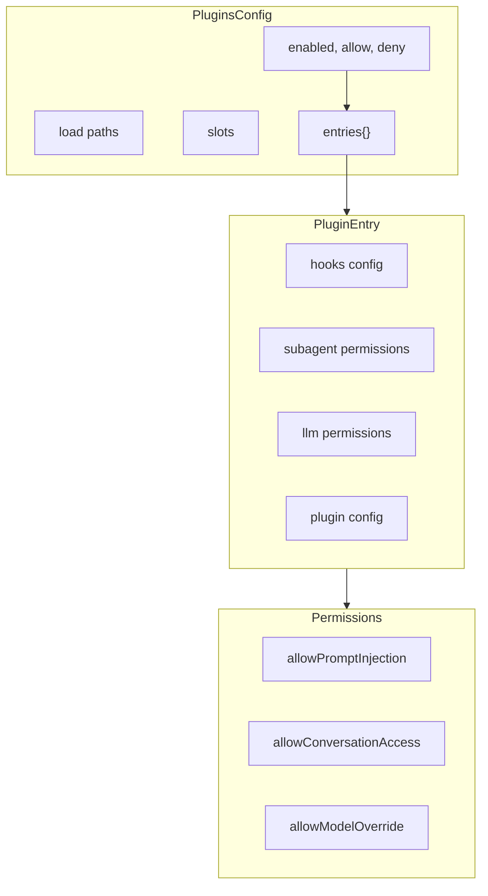
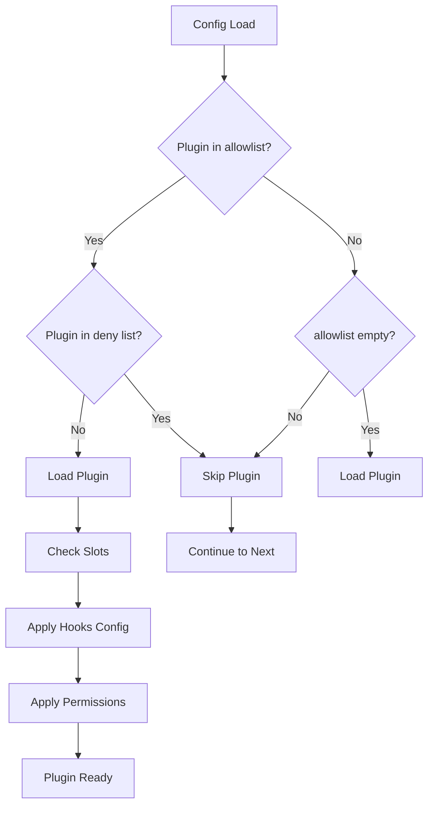

# 插件配置

## 概述

OpenClaw 的插件配置系统管理带有 hooks、权限和运行时边界的扩展。插件可以在定义的安全约束内扩展核心功能。



## 配置结构

### 主 Plugins 配置

```typescript
// src/config/types.plugins.ts
interface PluginsConfig {
  /** Enable or disable plugin loading. */
  enabled?: boolean;
  /** Plugin allowlist (plugin ids). */
  allow?: string[];
  /** Plugin denylist (plugin ids). */
  deny?: string[];
  /** Bundled plugin discovery mode. */
  bundledDiscovery?: "compat" | "allowlist";
  /** Additional plugin paths. */
  load?: PluginsLoadConfig;
  /** Plugin slot assignments. */
  slots?: PluginSlotsConfig;
  /** Per-plugin configurations. */
  entries?: Record<string, PluginEntryConfig>;
  /** Install records (transient, not persisted). */
  installs?: Record<string, PluginInstallRecord>;
}
```

### 插件发现模式

| 模式 | 描述 |
|------|-------------|
| `allowlist` | 捆绑的 Provider 插件由 `allow` 和 `entries.<id>.enabled` 控制 |
| `compat` | 旧模式；捆绑的 Provider 插件可以强制加载 |

### 插件入口配置

```typescript
interface PluginEntryConfig {
  /** Enable or disable this plugin. */
  enabled?: boolean;
  /** Hook permissions and timeouts. */
  hooks?: PluginHooksConfig;
  /** Subagent permissions. */
  subagent?: SubagentPermissionsConfig;
  /** LLM/runtime permissions. */
  llm?: LlmPermissionsConfig;
  /** Plugin-specific configuration. */
  config?: Record<string, unknown>;
}
```

## Hook 配置

### Hook 权限

```typescript
interface PluginHooksConfig {
  /** Allow prompt mutation via hooks. */
  allowPromptInjection?: boolean;
  /** Allow access to raw conversation content. */
  allowConversationAccess?: boolean;
  /** Default timeout for typed hooks (ms). */
  timeoutMs?: number;
  /** Per-hook timeout overrides (ms). */
  timeouts?: Record<string, number>;
}
```

### Hook 类型和超时

| Hook | 用途 | 默认超时 |
|------|---------|-----------------|
| `before_prompt_build` | 在构建前修改提示词 | 5000ms |
| `before_agent_start` | Agent 前置初始化 | 10000ms |
| `before_agent_run` | 运行前置处理 | 10000ms |
| `before_model_resolve` | 模型调用前置处理 | 5000ms |
| `before_agent_reply` | 回复前置处理 | 5000ms |
| `llm_input` | 记录/修改 LLM 输入 | 5000ms |
| `llm_output` | 记录/修改 LLM 输出 | 5000ms |
| `before_agent_finalize` | 终结前置处理 | 5000ms |
| `agent_end` | Agent 完成后处理 | 5000ms |

### Hook 配置示例

```json
{
  "plugins": {
    "entries": {
      "my-plugin": {
        "hooks": {
          "allowPromptInjection": true,
          "allowConversationAccess": false,
          "timeoutMs": 10000,
          "timeouts": {
            "before_agent_run": 15000,
            "llm_output": 8000
          }
        }
      }
    }
  }
}
```

## 模型覆盖权限

### 子 Agent 模型覆盖

```typescript
interface SubagentPermissionsConfig {
  /** Allow per-run provider/model overrides. */
  allowModelOverride?: boolean;
  /** Allowed override targets. Use "*" for any. */
  allowedModels?: string[];
}
```

### LLM 权限

```typescript
interface LlmPermissionsConfig {
  /** Allow model override for api.runtime.llm.complete. */
  allowModelOverride?: boolean;
  /** Allowed completion model targets. Use "*" for any. */
  allowedModels?: string[];
  /** Allow non-default agent id override. */
  allowAgentIdOverride?: boolean;
}
```

### 权限矩阵

| 权限 | 子 Agent Hooks | LLM Hooks | 默认值 |
|------------|---------------|-----------|---------|
| `allowModelOverride` | 是 | 是 | false |
| `allowedModels` | 是 | 是 | [] (无) |
| `allowAgentIdOverride` | 否 | 是 | false |

## 插件槽位

### 槽位分配

```typescript
interface PluginSlotsConfig {
  /** Memory slot owner ("none" disables). */
  memory?: string;
  /** Context engine slot owner. */
  contextEngine?: string;
}
```

### 槽位解析

```typescript
// Example slot configuration
{
  "plugins": {
    "slots": {
      "memory": "my-memory-plugin",
      "contextEngine": "my-context-plugin"
    }
  }
}

// A plugin can check slot ownership
if (plugin.id === config.plugins.slots.memory) {
  // This plugin owns memory
}
```

## 插件加载配置

### 附加路径

```typescript
interface PluginsLoadConfig {
  /** Additional plugin/extension paths. */
  paths?: string[];
}
```

```json
{
  "plugins": {
    "load": {
      "paths": [
        "/home/user/plugins/my-plugin",
        "./custom-plugins"
      ]
    }
  }
}
```

## 插件安装记录

### 市场安装

```typescript
// Transient record during install flows
interface PluginInstallRecord {
  id: string;
  source: "marketplace" | PluginSource;
  marketplaceName?: string;
  marketplaceSource?: string;
  marketplacePlugin?: string;
  // ... other InstallRecordBase fields
}
```

注意：安装记录是临时的，不会持久化到 `openclaw.json`。

## 插件 Schema 扩展

### UI 元数据

插件可以贡献 UI 元数据和 Schema：

```typescript
interface PluginUiMetadata {
  id: string;
  name?: string;
  description?: string;
  /** Config path -> UI hint mappings. */
  configUiHints?: Record<
    string,
    {
      label?: string;
      help?: string;
      tags?: string[];
      advanced?: boolean;
      sensitive?: boolean;
      placeholder?: string;
    }
  >;
  /** Additional JSON Schema nodes. */
  configSchema?: JsonSchemaNode;
}
```

### Schema 扩展限制

```typescript
const EXTENSION_SCHEMA_MAX_BYTES = 256 * 1024;      // 256KB per plugin
const EXTENSION_SCHEMA_TOTAL_MAX_BYTES = 2 * 1024 * 1024;  // 2MB total
const EXTENSION_SCHEMA_MAX_ITEMS = 256;            // Max 256 plugins
```

### 省略的 Schema

当插件 Schema 超出限制时：

```typescript
{
  type: "object",
  additionalProperties: true,
  description: "plugin config schema for ${id} was omitted due to size limits"
}
```

## 插件配置模式



## 示例配置

### 基本插件设置

```json
{
  "plugins": {
    "enabled": true,
    "allow": ["plugin-a", "plugin-b", "plugin-c"],
    "deny": ["broken-plugin"],
    "bundledDiscovery": "allowlist",
    "slots": {
      "memory": "official-memory-plugin"
    },
    "entries": {
      "plugin-a": {
        "enabled": true,
        "hooks": {
          "allowPromptInjection": true,
          "timeoutMs": 5000
        }
      },
      "plugin-b": {
        "enabled": true,
        "hooks": {
          "allowConversationAccess": true,
          "timeouts": {
            "before_agent_run": 15000
          }
        },
        "llm": {
          "allowModelOverride": true,
          "allowedModels": ["claude-sonnet-4", "gpt-4o"]
        }
      },
      "plugin-c": {
        "enabled": true,
        "subagent": {
          "allowModelOverride": true,
          "allowedModels": ["*"]
        },
        "config": {
          "customSetting": "value"
        }
      }
    }
  }
}
```

### 自定义插件路径

```json
{
  "plugins": {
    "enabled": true,
    "load": {
      "paths": [
        "/Users/dev/plugins/openclaw-my-plugin",
        "./local-plugins"
      ]
    },
    "entries": {
      "openclaw-my-plugin": {
        "enabled": true,
        "hooks": {
          "allowPromptInjection": false,
          "allowConversationAccess": false
        }
      }
    }
  }
}
```

### 内存插件槽位

```json
{
  "plugins": {
    "slots": {
      "memory": "openclaw-vector-memory"
    },
    "entries": {
      "openclaw-vector-memory": {
        "enabled": true,
        "config": {
          "vectorDbUrl": "http://localhost:6333",
          "collectionName": "openclaw_memory"
        }
      }
    }
  }
}
```

## 相关内容

- [配置 Schema](./01-config-schema.md) - Schema 架构
- [插件系统](../part-6-sdks-apis/02-plugin-sdk.md) - 插件开发
- [安全模型](../part-5-security/01-auth-permissions.md) - 权限模型
- [Hooks 系统](../part-2-core-modules/05-hooks.md) - Hook 实现
