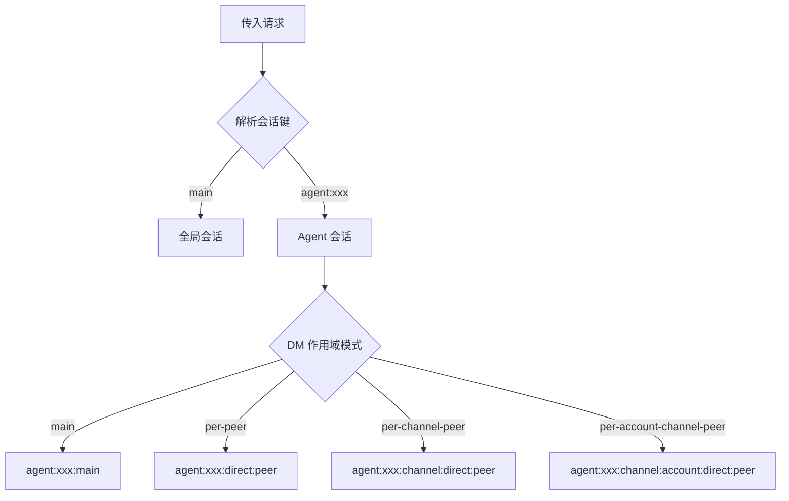
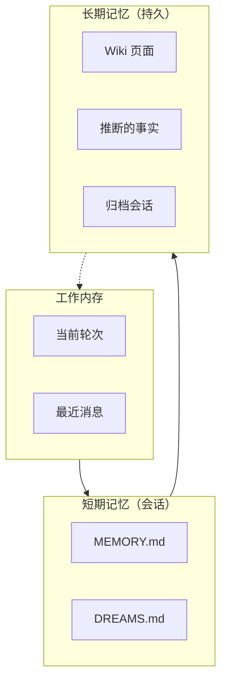
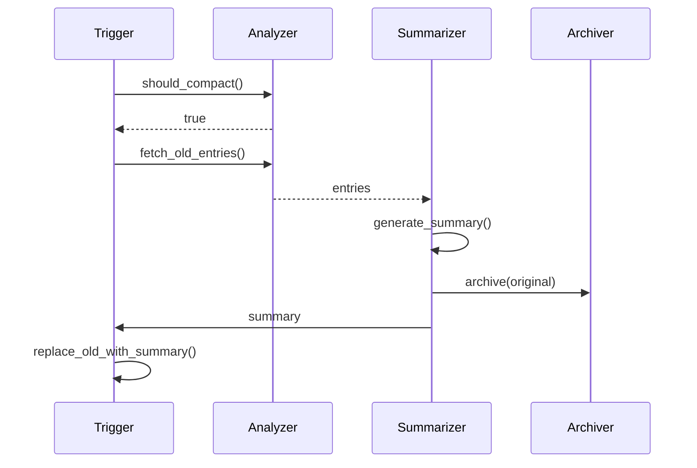

# 会话与内存

本部分涵盖 OpenClaw Agent 的会话管理、内存架构和上下文组装。

## 目录

1. [会话管理](#会话管理) - 会话生命周期和隔离
2. [内存系统](#内存系统) - 分层内存架构
3. [上下文引擎](#上下文引擎) - 上下文组装和 Token 预算
4. [内存压缩](#内存压缩) - 自动内存优化

## 会话管理

### 会话键架构

会话使用结构化键格式进行路由和隔离：

```typescript
// 会话键格式
type SessionKey =
  | "main"                                // 全局共享会话
  | `agent:${AgentId}:${Rest}`            // Agent 作用域会话
  | `agent:${AgentId}:${Channel}:...`     // Channel 特定会话
  | `agent:${AgentId}:global`              // 每个 Agent 的全局会话

// 键解析
interface ParsedAgentSessionKey {
  agentId: string;
  rest: string;        // agentId 之后的所有内容
  accountId?: string;  // 可选账户作用域
}
```

### 会话解析



### DM 作用域模式

| 模式 | 键格式 | 隔离级别 |
|------|--------|---------|
| `main` | `agent:id:main` | 单个共享会话 |
| `per-peer` | `agent:id:direct:peer` | 跨 Channel 的每个用户 |
| `per-channel-peer` | `agent:id:channel:direct:peer` | 每个 Channel 的每个用户 |
| `per-account-channel-peer` | `agent:id:channel:account:direct:peer` | 每个账户+Channel+用户 |

### 群组会话

群组会话遵循类似的模式，使用对等类型：

```typescript
// 群组键结构
interface GroupSessionKey {
  channel: string;      // "telegram", "discord"
  accountId?: string;    // 可选账户作用域
  peerKind: "group" | "channel";
  peerId: string;        // 平台特定的群组 ID
}

// 示例键
"telegram:group:chat123"
"discord:account1:group:channel456"
```

### 线程会话

线程使用后缀扩展基础会话：

```typescript
// 线程会话键
const baseKey = "agent:main:telegram:direct:user123";
const threadKey = `${baseKey}:thread:thread456`;

// 父会话跟踪
interface ThreadSession {
  sessionKey: string;
  parentSessionKey?: string;
  threadId: string;
}
```

## 内存系统

### 三层模型



### 内存文件

| 文件 | 用途 | 内容 |
|------|------|------|
| `MEMORY.md` | 会话上下文 | 当前任务、进行中的工作 |
| `DREAMS.md` | 推断的知识 | Model 反思、事实 |
| `memory/YYYY-MM-DD.md` | 每日归档 | 会话摘要 |
| `memory/archive/` | 长期存储 | 压缩的会话 |

### 内存条目类型

```typescript
type MemoryType =
  | "fact"        // 从对话中推断
  | "task"        // 任务或目标
  | "preference"  // 用户偏好
  | "knowledge"   // 通用知识
  | "context"     // 对话上下文
  | "summary"     // 压缩摘要
  | "reflection"  // Model 反思
  | "commitment"; // 声明的承诺

interface MemoryEntry {
  id: string;
  key: string;
  type: MemoryType;
  content: string;
  metadata: MemoryMetadata;
  createdAt: Date;
  updatedAt: Date;
  embedding?: number[];
}
```

## 上下文引擎

### 构建管道


### Token 预算

```typescript
interface ContextBudget {
  totalLimit: number;        // Model 上下文窗口
  reserved: {
    system: number;          // System Prompt
    tools: number;           // Tool 定义
    output: number;          // 响应缓冲
  };
  available: number;         // 用于上下文
  used: number;
}

// 示例预算
const budgets = {
  "gpt-4o": { totalLimit: 128000, available: 100000 },
  "claude-opus-4": { totalLimit: 200000, available: 180000 },
};
```

### 上下文注入

上下文从多个来源组装：

```typescript
interface ContextAssembly {
  memory: MemoryEntry[];     // 检索的内存
  recentMessages: Message[]; // 最近对话
  systemPrompt: string;      // 基础 System Prompt
  agentContext: AgentContext; // Agent 特定数据
  tools: ToolDefinition[];    // 可用 Tool
}
```

## 内存压缩

### 压缩触发器

| 触发器 | 条件 |
|--------|------|
| Token 限制 | 超过阈值 |
| 空闲 | 一段时间无活动 |
| 手动 | 显式的 `/compact` 命令 |
| 定时 | 每日 cron 任务 |

### 压缩策略

```typescript
type CompactionStrategy =
  | { type: "summarize"; maxTokens: number }
  | { type: "selective"; keepTypes: MemoryType[] }
  | { type: "archive"; archiveOlderThan: number }
  | { type: "compress"; algorithm: "gzip" | "lz4" };
```

### 压缩管道



## 多 Agent 内存

### 内存隔离

每个 Agent 有独立的内存：

```typescript
// Agent 作用域的内存路径
"~/.openclaw/agents/{agentId}/memory/"
```

### 共享内存

Agent 可以加入共享内存：

```typescript
config: {
  agents: {
    sharedMemory: {
      enabled: true,
      scope: "team",  // 或 "global"
    }
  }
}
```

## 相关

- [Agent 架构](/architecture-book/part-2-core-modules/02-agents) - Agent 系统
- [Gateway 核心](/architecture-book/part-2-core-modules/01-gateway) - Gateway 架构
- [配置系统](/architecture-book/part-7-config-system/01-config-schema) - 配置
