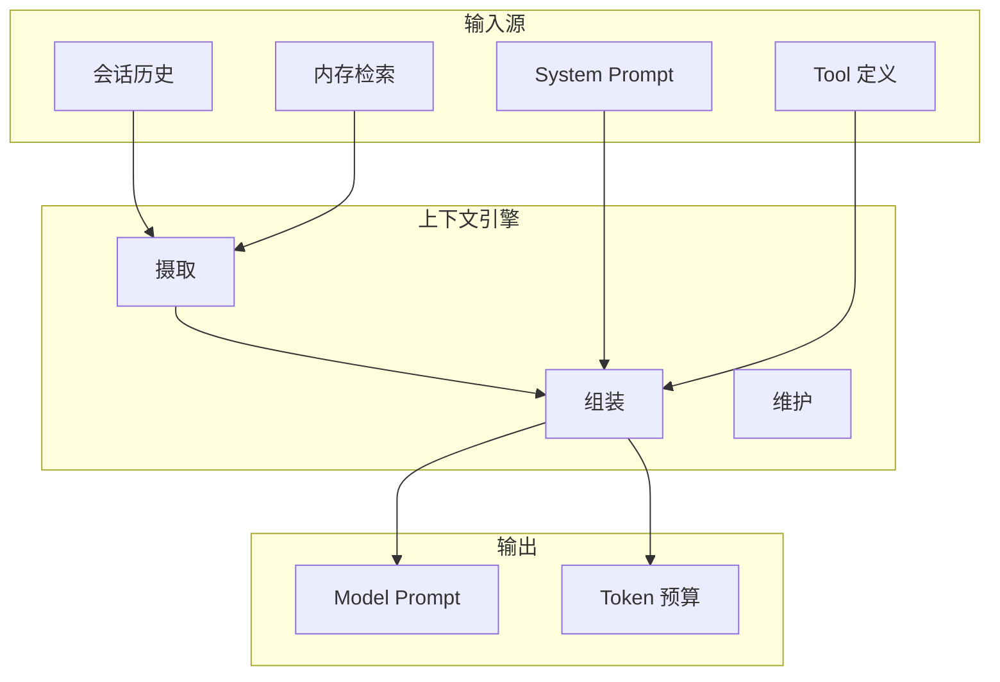
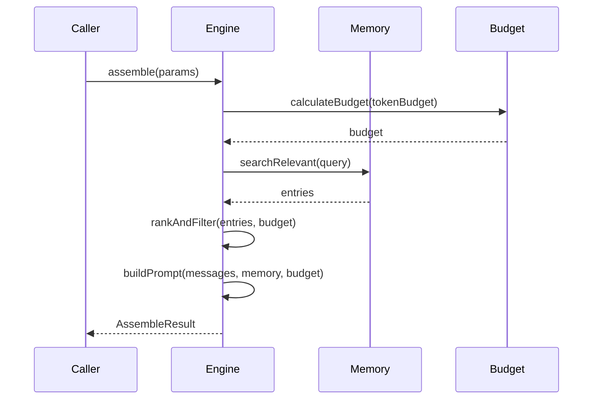
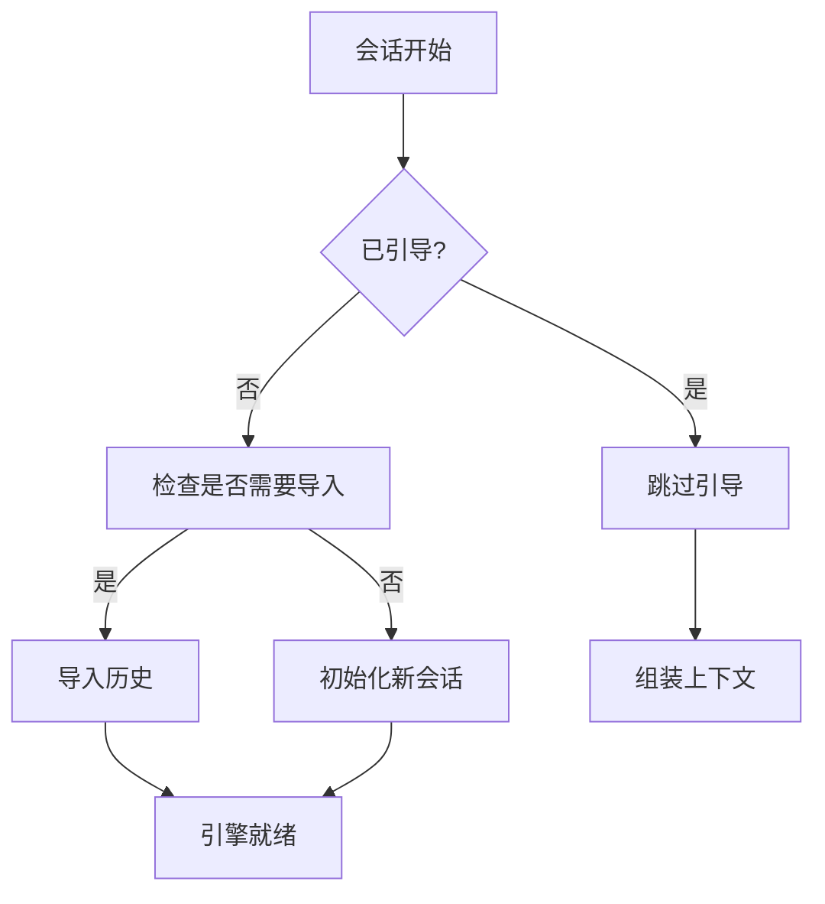

# 上下文引擎

## 概述

上下文引擎是一个可插拔的系统，负责在 Token 预算内组装 Model 上下文。它管理从会话历史到 Model 输入的流程，处理检索、排序、截断和注入。



## 核心接口

### ContextEngine 契约

```typescript
interface ContextEngine {
  readonly info: ContextEngineInfo;

  // 生命周期
  bootstrap?(params: BootstrapParams): Promise<BootstrapResult>;
  maintain?(params: MaintainParams): Promise<ContextEngineMaintenanceResult>;

  // 消息处理
  ingest(params: IngestParams): Promise<IngestResult>;
  ingestBatch?(params: IngestBatchParams): Promise<IngestBatchResult>;
  afterTurn?(params: AfterTurnParams): Promise<void>;

  // 上下文组装
  assemble(params: AssembleParams): Promise<AssembleResult>;

  // 压缩
  compact(params: CompactParams): Promise<CompactResult>;

  // Subagent 支持
  prepareSubagentSpawn?(params: SubagentSpawnParams): Promise<SubagentSpawnPreparation | undefined>;
  onSubagentEnded?(params: { childSessionKey: string; reason: SubagentEndReason }): Promise<void>;

  // 清理
  dispose?(): Promise<void>;
}
```

### 引擎信息

```typescript
interface ContextEngineInfo {
  id: string;
  name: string;
  version?: string;
  /** 当引擎管理自己的压缩生命周期时为 true。 */
  ownsCompaction?: boolean;
  /** 控制轮次触发维护的执行方式。 */
  turnMaintenanceMode?: "foreground" | "background";
}
```

## 组装上下文

### assemble() 方法

构建 Model 上下文的主要方法：

```typescript
interface AssembleParams {
  sessionId: string;
  sessionKey?: string;
  messages: AgentMessage[];
  tokenBudget?: number;
  /** 本次运行可用的 Tool 名称。 */
  availableTools?: Set<string>;
  /** 活跃内存引用模式。 */
  citationsMode?: MemoryCitationsMode;
  /** 当前 Model 标识符。 */
  model?: string;
  /** 本轮次的传入用户提示。 */
  prompt?: string;
}

interface AssembleResult {
  /** 用作 Model 上下文的有序消息 */
  messages: AgentMessage[];
  /** 组装上下文的估计 Token 总数 */
  estimatedTokens: number;
  /**
   * 控制 Runner 将哪个 Token 估计视为权威。
   * - "assembled": 仅使用组装提示的估计
   * - "preassembly_may_overflow": 使用组装和预组装估计的最大值
   */
  promptAuthority?: "assembled" | "preassembly_may_overflow";
  /** 预置到 System Prompt 的可选上下文引擎提供的指令 */
  systemPromptAddition?: string;
  /** 具有持久后端线程的主机的投影生命周期 */
  contextProjection?: ContextEngineProjection;
}
```

### Token 预算计算

```typescript
interface ContextBudget {
  totalLimit: number;        // Model 上下文窗口
  reserved: {
    system: number;          // System Prompt Token
    tools: number;          // Tool 定义 Token
    output: number;         // 响应缓冲 Token
  };
  available: number;        // 用于上下文组装
  used: number;             // 当前估计
}

// 各 Model 的示例预算
const budgets: Record<string, number> = {
  "claude-opus-4-7": 200000,
  "claude-sonnet-4.7": 200000,
  "gpt-4o": 128000,
  "gpt-4o-mini": 128000,
};
```

### 上下文组装管道



## 消息摄取

### 单条消息摄取

```typescript
interface IngestParams {
  sessionId: string;
  sessionKey?: string;
  message: AgentMessage;
  /** 当消息属于心跳运行时为 true。 */
  isHeartbeat?: boolean;
}

interface IngestResult {
  /** 消息是否被摄取（重复或无操作时为 false） */
  ingested: boolean;
}
```

### 批量摄取

为提高效率，多条消息可以一起摄取：

```typescript
interface IngestBatchParams {
  sessionId: string;
  sessionKey?: string;
  messages: AgentMessage[];
  isHeartbeat?: boolean;
}

interface IngestBatchResult {
  /** 从提供的批次中摄取的消息数 */
  ingestedCount: number;
}
```

## 会话引导

### 引导流程



### 引导参数

```typescript
interface BootstrapParams {
  sessionId: string;
  sessionKey?: string;
  sessionFile: string;
}

interface BootstrapResult {
  /** 引导是否运行并初始化了引擎的存储 */
  bootstrapped: boolean;
  /** 导入的历史消息数（如适用） */
  importedMessages?: number;
  /** 跳过引导时的可选原因 */
  reason?: string;
}
```

## 维护

### 轮次维护

每轮结束后，引擎可以执行维护任务：

```typescript
interface MaintainParams {
  sessionId: string;
  sessionKey?: string;
  sessionFile: string;
  runtimeContext?: ContextEngineRuntimeContext;
}

interface ContextEngineRuntimeContext {
  /** 选择消费延迟压缩债务时为 true */
  allowDeferredCompactionExecution?: boolean;
  /** 活跃 Model 调用的运行时解析的上下文窗口预算 */
  tokenBudget?: number;
  /** 尽力而为的当前提示/上下文 Token 计数 */
  currentTokenCount?: number;
  /** 缓存感知引擎的提示缓存遥测 */
  promptCache?: ContextEnginePromptCacheInfo;
  /** 安全转录重写助手 */
  rewriteTranscriptEntries?: (
    request: TranscriptRewriteRequest,
  ) => Promise<TranscriptRewriteResult>;
  /** LLM 完成能力 */
  llm?: {
    complete: (params: LlmCompleteParams) => Promise<LlmCompleteResult>;
  };
}
```

### 转录重写

引擎可以请求安全的分支-追加转录重写：

```typescript
interface TranscriptRewriteRequest {
  /** 在一次分支-追加操作中应用的转录条目替换 */
  replacements: TranscriptRewriteReplacement[];
}

interface TranscriptRewriteReplacement {
  /** 要替换的现有转录条目 ID */
  entryId: string;
  /** 替换的消息内容 */
  message: AgentMessage;
}

interface TranscriptRewriteResult {
  /** 活跃分支是否改变 */
  changed: boolean;
  /** 从活跃分支移除的估计字节数 */
  bytesFreed: number;
  /** 重写的转录条目数 */
  rewrittenEntries: number;
  reason?: string;
}
```

## 上下文投影

对于具有持久后端线程的主机：

```typescript
interface ContextEngineProjection {
  /** 组装上下文应如何投影 */
  mode: "per_turn" | "thread_bootstrap";
  /** 稳定的上下文 epoch。变化触发后端轮换 */
  epoch?: string;
  /** 可选的诊断指纹 */
  fingerprint?: string;
}
```

## 引擎注册表

### 注册

上下文引擎通过注册表注册：

```typescript
import { registerContextEngine, registerContextEngineForOwner } from "./registry.js";

// 用于公共 SDK 插件
registerContextEngine("my-engine", (ctx) => new MyContextEngine());

// 用于内部/核心引擎
registerContextEngineForOwner("my-engine", (ctx) => new MyEngine(), "core");
```

### 解析

```typescript
import { resolveContextEngine, listContextEngineIds } from "./registry.js";

// 解析配置的引擎
const engine = await resolveContextEngine(config, {
  agentDir: "/path/to/agent",
  workspaceDir: "/path/to/workspace",
});

// 列出可用引擎
const ids = listContextEngineIds(); // ["legacy", "my-engine", ...]
```

### 解析顺序

1. `config.plugins.slots.contextEngine`（显式插槽覆盖）
2. 默认插槽值（"legacy"）

## 内存引用

### 引用模式

```typescript
type MemoryCitationsMode = "auto" | "on" | "off";
```

| 模式 | 行为 |
|------|------|
| `auto` | 当 Model 支持引用时启用 |
| `on` | 始终启用 |
| `off` | 禁用 |

### 引用处理

```typescript
interface MemoryCitation {
  memoryId: string;
  source: "memory" | "wiki" | "session";
  relevanceScore: number;
  snippet: string;
}
```

## Subagent spawn 准备

上下文引擎可以在 subagent 启动前准备状态：

```typescript
interface SubagentSpawnParams {
  parentSessionKey: string;
  childSessionKey: string;
  contextMode?: "isolated" | "fork";
  parentSessionId?: string;
  parentSessionFile?: string;
  childSessionId?: string;
  childSessionFile?: string;
  ttlMs?: number;
}

interface SubagentSpawnPreparation {
  /** 当 spawn 失败时回滚预 spawn 设置 */
  rollback: () => void | Promise<void>;
}

type SubagentEndReason = "deleted" | "completed" | "swept" | "released";
```

## 相关

- [内存系统](/architecture-book/part-8-session-memory/02-memory-system) - 内存架构
- [内存压缩](/architecture-book/part-8-session-memory/04-compaction) - 上下文缩减
- [多 Agent](/architecture-book/part-8-session-memory/05-multi-agent) - 多 Agent 会话
- [Agent 系统](/architecture-book/part-2-core-modules/02-agents) - Agent Runtime
