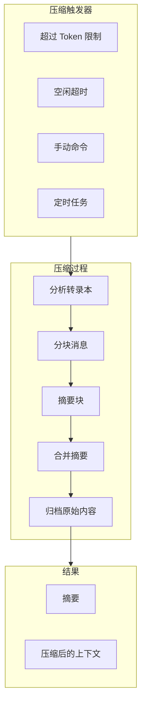
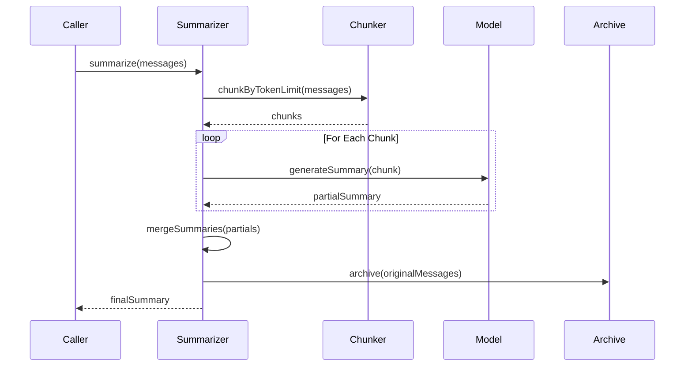

# 内存压缩

## 概述

当 Token 限制即将达到时，内存压缩会减少上下文大小。OpenClaw 使用多阶段摘要方法，优雅地处理超大的转录本。



## 压缩结果

### CompactResult 结构

```typescript
interface CompactResult {
  ok: boolean;
  compacted: boolean;
  reason?: string;
  result?: {
    /** 生成的摘要文本 */
    summary?: string;
    /** 压缩后保留的第一个条目 ID */
    firstKeptEntryId?: string;
    /** 压缩前的 Token 数 */
    tokensBefore: number;
    /** 压缩后的 Token 数 */
    tokensAfter?: number;
    /** 摘要的附加细节 */
    details?: unknown;
    /** 转录本轮换时的新会话 ID */
    sessionId?: string;
    /** 转录本轮换时的新会话文件 */
    sessionFile?: string;
  };
}
```

## 分块策略

### 基于 Token 的分块

消息按 Token 数量分割以适应 Model 限制：

```typescript
export const BASE_CHUNK_RATIO = 0.4;      // 上下文窗口的 40%
export const MIN_CHUNK_RATIO = 0.15;     // 最小 15%
export const SAFETY_MARGIN = 1.2;        // 估计的 20% 缓冲

/**
 * 按最大 Token 限制分块消息。
 */
export function chunkMessagesByMaxTokens(
  messages: AgentMessage[],
  maxTokens: number,
): AgentMessage[][] {
  // 应用安全边际以补偿 estimateTokens() 的低估
  const effectiveMax = Math.max(1, Math.floor(maxTokens / SAFETY_MARGIN));

  const chunks: AgentMessage[][] = [];
  let currentChunk: AgentMessage[] = [];
  let currentTokens = 0;

  for (const message of messages) {
    const messageTokens = estimateCompactionMessageTokens(message);
    if (currentChunk.length > 0 && currentTokens + messageTokens > effectiveMax) {
      chunks.push(currentChunk);
      currentChunk = [];
      currentTokens = 0;
    }

    currentChunk.push(message);
    currentTokens += messageTokens;

    if (messageTokens > effectiveMax) {
      chunks.push(currentChunk);
      currentChunk = [];
      currentTokens = 0;
    }
  }

  if (currentChunk.length > 0) {
    chunks.push(currentChunk);
  }

  return chunks;
}
```

### 按 Token 份额分割

用于多部分摘要：

```typescript
export const DEFAULT_PARTS = 2;

export function splitMessagesByTokenShare(
  messages: AgentMessage[],
  parts = DEFAULT_PARTS,
): AgentMessage[][] {
  if (messages.length === 0) return [];

  const totalTokens = estimateMessagesTokens(messages);
  const targetTokens = totalTokens / parts;

  const chunks: AgentMessage[][] = [];
  let current: AgentMessage[] = [];
  let currentTokens = 0;
  let pendingToolCallIds = new Set<string>();
  let pendingChunkStartIndex: number | null = null;

  for (const message of messages) {
    // 分割逻辑保留 Tool 调用/结果配对
    // ...
  }

  return chunks;
}
```

### 自适应分块比率

基于平均消息大小计算最优块大小：

```typescript
export function computeAdaptiveChunkRatio(
  messages: AgentMessage[],
  contextWindow: number,
): number {
  if (messages.length === 0) {
    return BASE_CHUNK_RATIO;
  }

  const totalTokens = estimateMessagesTokens(messages);
  const avgTokens = totalTokens / messages.length;
  const safeAvgTokens = avgTokens * SAFETY_MARGIN;
  const avgRatio = safeAvgTokens / contextWindow;

  // 对大消息减少分块比率
  if (avgRatio > 0.1) {
    const reduction = Math.min(avgRatio * 2, BASE_CHUNK_RATIO - MIN_CHUNK_RATIO);
    return Math.max(MIN_CHUNK_RATIO, BASE_CHUNK_RATIO - reduction);
  }

  return BASE_CHUNK_RATIO;
}
```

## 摘要管道

### 完整管道流程



### 渐进式摘要

```typescript
export async function summarizeInStages(params: {
  messages: AgentMessage[];
  model: ExtensionContext["model"];
  apiKey: string;
  reserveTokens: number;
  maxChunkTokens: number;
  contextWindow: number;
  customInstructions?: string;
  previousSummary?: string;
  parts?: number;
  minMessagesForSplit?: number;
}): Promise<string> {
  const { messages } = params;

  if (messages.length === 0) {
    return params.previousSummary ?? "No prior history.";
  }

  const minMessagesForSplit = Math.max(2, params.minMessagesForSplit ?? 4);
  const parts = normalizeParts(params.parts ?? DEFAULT_PARTS, messages.length);
  const totalTokens = estimateMessagesTokens(messages);

  // 内容不足时使用单个块
  if (parts <= 1 || messages.length < minMessagesForSplit ||
      totalTokens <= params.maxChunkTokens) {
    return summarizeWithFallback(params);
  }

  // 分割成多个部分，分别摘要，然后合并
  const splits = splitMessagesByTokenShare(messages, parts);
  const partialSummaries: string[] = [];

  for (const chunk of splits) {
    const summary = await summarizeWithFallback({
      ...params,
      messages: chunk,
      previousSummary: partialSummaries.length > 0
        ? partialSummaries[partialSummaries.length - 1]
        : undefined,
    });
    partialSummaries.push(summary);
  }

  // 合并所有部分摘要
  return mergePartialSummaries(partialSummaries, params);
}
```

### 回退策略

处理无法摘要的超大消息：

```typescript
export async function summarizeWithFallback(params: {
  messages: AgentMessage[];
  contextWindow: number;
  // ... 其他参数
}): Promise<string> {
  // 首先尝试完整摘要
  try {
    return await summarizeChunks(params);
  } catch (fullError) {
    log.warn(`Full summarization failed: ${fullError}`);
  }

  // 回退：只摘要小消息
  const smallMessages: AgentMessage[] = [];
  const oversizedNotes: string[] = [];

  for (const msg of messages) {
    if (isOversizedForSummary(msg, params.contextWindow)) {
      oversizedNotes.push(
        `[Large ${msg.role} (~${tokens}K tokens) omitted]`
      );
    } else {
      smallMessages.push(msg);
    }
  }

  if (smallMessages.length > 0 && smallMessages.length !== messages.length) {
    try {
      const partialSummary = await summarizeChunks({
        ...params,
        messages: smallMessages,
      });
      return partialSummary + "\n\n" + oversizedNotes.join("\n");
    } catch (partialError) {
      log.warn(`Partial summarization also failed`);
    }
  }

  // 最终回退
  return `Context contained ${messages.length} messages ` +
    `(${oversizedNotes.length} oversized). Summary unavailable.`;
}
```

## 标识符保留

### 策略类型

```typescript
type AgentCompactionIdentifierPolicy = "strict" | "loose" | "off";

export const IDENTIFIER_PRESERVATION_INSTRUCTIONS =
  "Preserve all opaque identifiers exactly as written (no shortening " +
  "or reconstruction), including UUIDs, hashes, IDs, hostnames, IPs, " +
  "ports, URLs, and file names.";
```

### 摘要指令

```typescript
interface CompactionSummarizationInstructions {
  identifierPolicy?: AgentCompactionIdentifierPolicy;
  identifierInstructions?: string;
}

const MERGE_SUMMARIES_INSTRUCTIONS = [
  "Merge these partial summaries into a single cohesive summary.",
  "",
  "MUST PRESERVE:",
  "- Active tasks and their current status",
  "- Batch operation progress",
  "- The last thing the user requested",
  "- Decisions made and their rationale",
  "- TODOs, open questions, and constraints",
  "- Any commitments or follow-ups promised",
  "",
  "PRIORITIZE recent context over older history.",
].join("\n");
```

## 开销计算

### 摘要开销

```typescript
// 为摘要提示、System Prompt、之前摘要和序列化包装器保留的开销
export const SUMMARIZATION_OVERHEAD_TOKENS = 4096;
```

### Token 估计

```typescript
function estimateMessagesTokens(messages: AgentMessage[]): number {
  // 安全：toolResult.details 和运行时上下文条目
  // 决不能进入面向 LLM 的压缩
  const safe = stripToolResultDetails(
    stripRuntimeContextCustomMessages(messages)
  );
  return safe.reduce((sum, msg) => sum + estimateTokens(msg), 0);
}
```

## 交接摘要

用于 Model 之间的配额限制交接：

```typescript
const HANDOFF_INSTRUCTIONS = [
  "Generate a concise recovery briefing for a new LLM taking over this session.",
  "The previous model hit a quota limit and you are providing the context.",
  "",
  "LEADER HIERARCHY REINFORCEMENT:",
  "- Explicitly state that the new model is the LEADER (Orchestrator).",
  "- Identify any active autonomous units as SUBORDINATES.",
  "- Instruct the new model to NOT perform the subordinate's task.",
  "",
  "MUST CAPTURE:",
  "- Current high-level goal and project path.",
  "- Status of the latest tool executions.",
  "- Critical files currently being modified.",
  "- Pending items and next intended steps.",
].join("\n");
```

## 压缩触发器

### 自动触发

| 触发器 | 条件 | 优先级 |
|--------|------|--------|
| Token 限制 | 超过阈值 | 高 |
| 轮次计数 | 每 N 轮 | 中 |
| 空闲超时 | 无活动 | 低 |

### 手动触发

```typescript
// 通过命令
openclaw compact

// 通过 Tool
await agent.tools.compact({ force: true });
```

### Runtime 集成

```typescript
interface CompactParams {
  sessionId: string;
  sessionKey?: string;
  sessionFile: string;
  tokenBudget?: number;
  /** 即使低于默认阈值也强制压缩 */
  force?: boolean;
  /** 活跃上下文的当前 Token 估计 */
  currentTokenCount?: number;
  /** 控制收敛目标 */
  compactionTarget?: "budget" | "threshold";
  customInstructions?: string;
  runtimeContext?: ContextEngineRuntimeContext;
}
```

## 安全措施

### 超大消息检测

```typescript
/**
 * 检查单条消息是否太大无法摘要。
 * 如果单条消息 > 上下文的 50%，则无法安全摘要。
 */
export function isOversizedForSummary(
  msg: AgentMessage,
  contextWindow: number
): boolean {
  const tokens = estimateCompactionMessageTokens(msg) * SAFETY_MARGIN;
  return tokens > contextWindow * 0.5;
}
```

### 重试逻辑

```typescript
await retryAsync(
  () => generateSummary(chunk, model, reserveTokens, apiKey, signal, instructions, previousSummary),
  {
    attempts: 3,
    minDelayMs: 500,
    maxDelayMs: 5000,
    jitter: 0.2,
    label: "compaction/generateSummary",
    shouldRetry: (err) => !isAbortError(err) && !isTimeoutError(err),
  }
);
```

## 相关

- [上下文引擎](/architecture-book/part-8-session-memory/03-context-engine) - 上下文组装
- [内存系统](/architecture-book/part-8-session-memory/00-session-memory-overview) - 内存架构
- [Agent 系统](/architecture-book/part-2-core-modules/02-agents) - Agent Runtime
- [会话管理](/architecture-book/part-2-core-modules/03-sessions) - 会话生命周期
