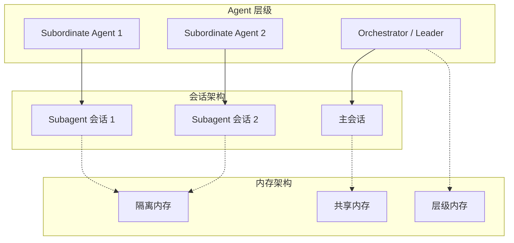
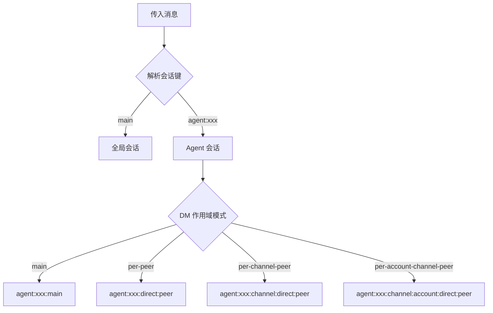

# 多 Agent 内存和路由

## 概述

多 Agent 设置需要仔细的会话路由、内存隔离和上下文共享策略。OpenClaw 提供了灵活的机制来管理 Agent 之间的通信和共享状态。



## 会话键架构

### 键格式

Agent 会话使用结构化键格式：

```typescript
type SessionKey =
  | "main"                              // 全局共享会话
  | "global"                            // 跨 Agent 的全局会话
  | `agent:${AgentId}:${Rest}`          // Agent 作用域
  | `agent:${AgentId}:${Channel}:...`   // Channel 特定
  | `agent:${AgentId}:main`             // 每个 Agent 的主会话

// 键解析
interface ParsedAgentSessionKey {
  agentId: string;
  rest: string;
  accountId?: string;
}
```

### 键解析

```typescript
import { parseAgentSessionKey, isSubagentSessionKey } from "../routing/session-key.js";

// 解析会话键
const parsed = parseAgentSessionKey("agent:myagent:telegram:direct:user123");
if (parsed) {
  console.log(parsed.agentId);    // "myagent"
  console.log(parsed.rest);       // "telegram:direct:user123"
}

// 检查是否是 subagent 会话
const isSub = isSubagentSessionKey("agent:parent:agent:child:main");
```

## Agent 作用域

### 作用域配置

```typescript
interface AgentDefaultsConfig {
  session?: {
    dmScope?: DmScopeMode;
    groupScope?: GroupScopeMode;
  };
}

type DmScopeMode = "main" | "per-peer" | "per-channel-peer" | "per-account-channel-peer";
```

### 默认 Agent 目录

```typescript
// Agent 目录遵循此结构
"~/.openclaw/agents/{agentId}/"
```

## Subagent Spawning

### ACP Spawn 协议

Agent 可以通过 ACP（Agent 通信协议）spawn 子 Agent：

```typescript
interface SpawnAcpParams {
  task: string;                    // 任务描述
  label?: string;                  // 可选标签
  agentId?: string;                // 目标 Agent ID
  resumeSessionId?: string;         // 从会话恢复
  model?: string;                  // 指定 Model
  thinking?: string;               // 思考模式
  runTimeoutSeconds?: number;       // 超时
  cwd?: string;                    // 工作目录
  mode?: SpawnAcpMode;             // "run" | "session"
  thread?: boolean;                // 线程模式
  sandbox?: SpawnAcpSandboxMode;   // 沙箱继承
  streamTo?: SpawnAcpStreamTarget; // 流目标
}

type SpawnAcpMode = "run" | "session";
type SpawnAcpSandboxMode = "inherit" | "require";
```

### Spawn 上下文

```typescript
interface SpawnAcpContext {
  agentSessionKey?: string;
  agentChannel?: string;
  agentAccountId?: string;
  agentTo?: string;
  agentThreadId?: string | number;
  agentGroupId?: string;
  agentGroupSpace?: string | null;
  agentMemberRoleIds?: string[];
  sandboxed?: boolean;
  inheritedToolAllowlist?: string[];
  inheritedToolDenylist?: string[];
}
```

## 上下文引擎 Subagent 支持

### Prepare Subagent Spawn

上下文引擎可以在 subagent 启动前准备状态：

```typescript
interface SubagentSpawnParams {
  parentSessionKey: string;
  childSessionKey: string;
  contextMode?: "isolated" | "fork";
  parentSessionId?: string;
  parentSessionFile?: string;
  childSessionId?: string;
  childSessionFile?: string;
  ttlMs?: number;
}

interface SubagentSpawnPreparation {
  rollback: () => void | Promise<void>;
}

type SubagentEndReason = "deleted" | "completed" | "swept" | "released";
```

### 上下文模式

| 模式 | 行为 |
|------|------|
| `isolated` | Subagent 有自己独立的上下文 |
| `fork` | Subagent 从父上下文 fork 副本开始 |

## 内存隔离策略

### Per-Agent 隔离

```mermaid
flowchart LR
    subgraph Agent1["Agent 1"]
        M1_1[memory/]
        M1_2[MEMORY.md]
        M1_3[DREAMS.md]
    end

    subgraph Agent2["Agent 2"]
        M2_1[memory/]
        M2_2[MEMORY.md]
        M2_3[DREAMS.md]
    end

    subgraph Agent3["Agent 3"]
        M3_1[memory/]
        M3_2[MEMORY.md]
        M3_3[DREAMS.md]
    end

    M1_1 -.x M2_1
    M1_1 -.x M3_1
    M2_1 -.x M3_1
```

### 共享内存配置

```typescript
interface SharedMemoryConfig {
  enabled: boolean;
  scope: "team" | "global";
  syncInterval?: number;
}

// 配置示例
const config = {
  agents: {
    sharedMemory: {
      enabled: true,
      scope: "team",
    }
  }
};
```

## 会话路由

### 路由解析



### 会话解析代码

```typescript
import { buildAgentPeerSessionKey, buildAgentMainSessionKey } from "../routing/session-key.js";

// 构建主会话键
const mainKey = buildAgentMainSessionKey({
  agentId: "myagent",
  mainKey: "main",
});
// "agent:myagent:main"

// 构建对等会话键
const peerKey = buildAgentPeerSessionKey({
  agentId: "myagent",
  channel: "telegram",
  peerKind: "direct",
  peerId: "user123",
  dmScope: "per-peer",
});
// "agent:myagent:telegram:direct:user123"
```

## 跨 Agent 通信

### 通过会话绑定

```typescript
import { getSessionBindingService } from "../infra/outbound/session-binding-service.js";

// 创建跨 Agent 通信的会话绑定
const binding = await getSessionBindingService().createBinding({
  sourceSessionKey: "agent:parent:main",
  targetSessionKey: "agent:child:main",
  mode: "relay",
});
```

### 通过消息传递

```typescript
// Agent 可以向其他 Agent 的会话发送消息
await agent.sendMessage({
  sessionKey: "agent:other-agent:main",
  content: "Task completed: ...",
  metadata: {
    taskId: "123",
    correlationId: "abc",
  },
});
```

## Subagent 注册表

### 活跃运行跟踪

```typescript
import { countActiveRunsForSession, getSubagentRunByChildSessionKey } from "./subagent-registry.js";

// 统计会话的活跃运行数
const activeCount = countActiveRunsForSession("agent:parent:main");

// 通过子会话键获取 subagent 运行
const run = getSubagentRunByChildSessionKey("agent:parent:agent:child:main");
```

### 深度跟踪

```typescript
import { getSubagentDepthFromSessionStore } from "./subagent-depth.js";

// 获取 subagent 的嵌套深度
const depth = getSubagentDepthFromSessionStore(store, "agent:parent:agent:child:main");
// depth = 2
```

## 内存提升

### Dreaming 系统

内存条目可以通过层级提升：

```typescript
// 内存 dreaming 类型
type MemoryLightDreamingSource = "daily" | "sessions" | "recall";
type MemoryDeepDreamingSource = "daily" | "memory" | "sessions" | "logs" | "recall";
type MemoryRemDreamingSource = "memory" | "daily" | "deep";

// 配置
const dreamingConfig = {
  light: {
    cron: "0 */6 * * *",      // 每 6 小时
    lookbackDays: 2,
    limit: 100,
  },
  deep: {
    cron: "0 3 * * *",         // 每天凌晨 3 点
    limit: 10,
    minScore: 0.8,
  },
  rem: {
    cron: "0 5 * * 0",         // 每周日凌晨 5 点
    lookbackDays: 7,
    limit: 10,
  },
};
```

## 多 Agent 中的 Model 回退

### 自动回退探测

```typescript
interface AutoFallbackPrimaryProbe {
  provider: string;
  model: string;
  fallbackProvider: string;
  fallbackModel: string;
  fallbackAuthProfileId?: string;
  fallbackAuthProfileIdSource?: "auto" | "user";
}
```

### 回退解析

```typescript
import { resolveAutoFallbackPrimaryProbe, markAutoFallbackPrimaryProbe } from "./agent-scope.ts";

// 检查是否需要回退
const probe = resolveAutoFallbackPrimaryProbe({
  entry: sessionEntry,
  primaryProvider: "anthropic",
  primaryModel: "claude-opus-4-7",
});

// 标记探测为活跃
if (probe) {
  markAutoFallbackPrimaryProbe({ probe, sessionKey });
}
```

## Subagent 能力

### 能力解析

```typescript
interface SubagentCapabilityStore {
  canSpawnSubagents?: boolean;
  maxChildren?: number;
  maxDepth?: number;
  allowedToolPatterns?: string[];
}

import { resolveSubagentCapabilities, resolveSubagentCapabilityStore } from "./subagent-capabilities.js";

const capabilities = resolveSubagentCapabilities(parentAgentId);
const store = resolveSubagentCapabilityStore(storeEntry);
```

## 事件处理

### Subagent 生命周期事件

```typescript
// Subagent 生命周期期间发出的事件
type SubagentEvent =
  | { type: "spawn_start"; childSessionKey: string }
  | { type: "spawn_complete"; childSessionKey: string; runId: string }
  | { type: "spawn_failed"; childSessionKey: string; error: string }
  | { type: "subagent_ended"; childSessionKey: string; reason: SubagentEndReason };
```

### 事件监听器

```typescript
contextEngine.onSubagentEnded?.({
  childSessionKey: "agent:parent:agent:child:main",
  reason: "completed",
});
```

## 配置最佳实践

### 层级设置

```typescript
const config = {
  agents: {
    // Orchestrator Agent
    orchestrator: {
      slots: {
        contextEngine: "legacy",
      },
    },
    // 具有隔离的工作 Agent
    workers: {
      slots: {
        contextEngine: "isolated",
      },
    },
  },
  // 团队协作的共享内存
  sharedMemory: {
    enabled: true,
    scope: "team",
  },
};
```

### 隔离 vs 共享

| 使用场景 | 策略 |
|----------|------|
| 专业工作 Agent | 完全隔离 |
| 协作 Agent | 共享内存 |
| 父子委派 | 带交接的层级 |
| 并发任务 | 带独立内存的 Fork |

## 相关

- [会话管理](/architecture-book/part-2-core-modules/03-sessions) - 会话架构
- [上下文引擎](/architecture-book/part-8-session-memory/03-context-engine) - 上下文组装
- [内存压缩](/architecture-book/part-8-session-memory/04-compaction) - 上下文缩减
- [内存系统](/architecture-book/part-8-session-memory/02-memory-system) - 内存架构
- [Agent 系统](/architecture-book/part-2-core-modules/02-agents) - Agent Runtime
