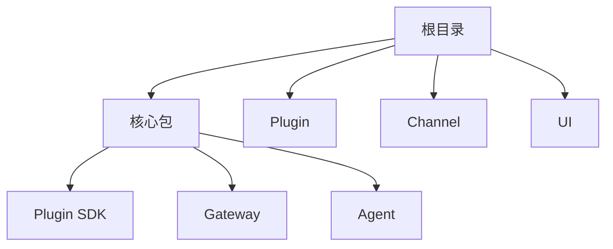

# 开发者指南

## 概述

本指南涵盖 OpenClaw 的开发工作流、测试、构建和部署。

## 开发环境设置

### 前置条件

- Node.js 22.19+（推荐 Node 24）
- pnpm 包管理器
- Git

### 安装

```bash
# 克隆仓库
git clone https://github.com/openclaw/openclaw

# 安装依赖
pnpm install

# 构建项目
pnpm build
```

### 本地运行

```bash
# 启动 Gateway
pnpm dev

# 或使用特定配置
pnpm openclaw --config ~/.openclaw/config.toml
```

## 构建系统

### 构建命令

| 命令 | 描述 |
|------|------|
| `pnpm build` | 构建所有包 |
| `pnpm build:watch` | 开发模式监视 |
| `pnpm build:types` | 生成 TypeScript 声明 |

### 包结构



## 测试

### 测试命令

```bash
# 运行所有测试
pnpm test

# 运行特定测试文件
pnpm test src/agents/agent-command.test.ts

# 带覆盖率运行测试
pnpm test:coverage

# 只运行更改的测试
pnpm test:changed

# 串行运行测试
pnpm test:serial
```

### 测试配置

```typescript
// vitest.config.ts
export default defineConfig({
  test: {
    globals: true,
    environment: "node",
    setupFiles: ["test/helpers/setup.ts"],
    coverage: {
      provider: "v8",
      reporter: ["text", "json", "html"],
    },
  },
});
```

### 编写测试

```typescript
// src/agents/example.test.ts
import { describe, it, expect, vi } from "vitest";

describe("Agent 命令", () => {
  it("应该解析命令参数", () => {
    const result = parseCommand("/help arg1 arg2");
    expect(result.command).toBe("help");
    expect(result.args).toEqual(["arg1", "arg2"]);
  });
});
```

## 代码质量

### 静态检查

```bash
# 运行所有检查器
pnpm lint

# 运行特定检查器
pnpm lint:oxlint
pnpm lint:tsc

# 格式化代码
pnpm format
```

### 类型检查

```bash
# 类型检查（仅 tsgo lanes）
pnpm tsgo

# 完整类型检查
pnpm check:types
```

### Git 钩子

预提交钩子自动运行：

```bash
# 格式检查
oxlint

# 类型检查
tsc --noEmit

# 测试
vitest run
```

## 调试

### 日志

```typescript
// 启用调试日志
OPENCLAW_LOG_LEVEL=debug pnpm dev

# 日志到文件
OPENCLAW_LOG_FILE=/tmp/openclaw.log pnpm dev
```

### 远程调试

```bash
# 附加到运行中的 Gateway
openclaw debug --attach

# 查看日志
./scripts/clawlog.sh
```

## 部署

### 生产构建

```bash
# 生产构建
pnpm build --prod

# 打包 Plugin
pnpm build:bundle
```

### Docker

```dockerfile
FROM node:24-alpine
WORKDIR /app
COPY package.json pnpm-lock.yaml ./
RUN pnpm install --frozen-lockfile
COPY . .
RUN pnpm build
CMD ["pnpm", "start"]
```

### 配置

```bash
# 导出配置
openclaw config export > config.toml

# 验证配置
openclaw doctor
```

## 相关

- [架构概述](/architecture-book/part-1-foundations/02-system-overview) - 系统设计
- [Plugin 系统](/architecture-book/part-3-plugin-system/01-plugin-architecture) - Plugin 开发
- [Gateway 协议](/architecture-book/part-4-gateway-protocol/01-protocol-overview) - 协议详情
